## 前言

在做互联网产品时，业务需求是与相关利益方（用户、业务方、运营、市场）不断交流沟通获得的。

怎么进行系统性地收集、分析，然后结构化各方的业务需求？

业务需求是产品设计的根本输入，其质量直接决定后续产品设计和技术设计，所以非常重要。

## 与相关利益方沟通

产品设计的起点并非写 PRD（产品需求文档）或画原型图，而是与相关人员沟通，捕获他们的需求，。

理解一个复杂问题域的第一项，也是最关键的一项任务，是识别并与所有利益相关方建立有效沟通。每一类相关方都置身于各自的工作环境之下，拥有不同的目标、思维模式和专业术语。需要将他们分散的关切和问题、模糊的期望、内心需求和潜在的矛盾，进行收集后分析，在整合出需求文档。

与产品业务需求相关的最大利益方：用户、业务、运营、市场。

**用户**：

用户是产品最终使用者，可以是外部用户，也可以是内部用户或其他系统。这些人的核心关切有哪些？是否直观易用、能否高效解决他们的实际问题、产品是否稳定。这些用户对产品的满意度直接决定了产品的价值。

与用户沟通，要注意洞察和共情，站在对方位置思考。方法有：直接访谈、用户行为数据分析、下场实际考察等等。重要的是观察其行为而不仅听其陈述。

**业务方：**

业务方包括：产品经理、业务负责人、管理层等，他们代表了公司商业利益。

他们关心产品的商业价值和投资回报，产品功能如何带来收入、降低成本、获取市场份额等。这些人要在资源、时间和范围之间做出对产品功能的权衡。

**运营方：**

运营方包括：产品运营人员、产品运维工程师、技术支持团队。是对产品运营和运维的人员。

产品运营人员希望产品功能好用、产品操作体验优秀，研发能及时开发运营人员需要的活动。

运维工程师负责线上系统运行流畅，稳定性、可维护性，如何部署、监控、排错和保障系统7x24小时平稳运行。

**市场：**

市场方包括：市场团队、销售团队、战略合作伙伴。

他们关注产品如何在市场上脱颖而出、如何快速抢占市场窗口，以及如何与外部生态无缝连接。

## 需求收集

### 需求收集介绍

需求收集，一般会把业务需求和用户需求分开看，但方法上是同一套工具，只是问的对象不一样。

**业务需求**：

- 问的对象：老板、业务负责人、运营、销售、客服主管等
- 问的内容：业务目标、KPI、流程现状、业务困难、合规要求、成本/收益预期、市场情况等
- 常用方法：访谈（业务方）、问卷、业务文档分析、流程梳理、数据分析（业务指标分析）等

**用户需求**：

- 问的对象：终端用户、客户、一线操作人员等
- 问的内容：使用场景、目标和任务、痛点和障碍、当前替代做法、偏好和期望等
- 常用方法：用户访谈、问卷、观察/情境访谈、原型产品/可用性测试、用户场景分析等

下面介绍需求收集和分析的一些方法：用户访谈、用户故事、用户故事图、用例分析和业务流程梳理。

## 需求分析方法

### 用户访谈

1、**结构化访谈**

问用户的问题和选项是基本固定的，有一个问题清单，按先前拟好的清单逐一提问，然后记录下用户的回复或回答。

这种方法适用需要标准化、多人对比的场景，比如调研多个分支的统一操作流程。

2、**半结构化访谈**

先前有写好提纲和关键问题，但顺序可调整，会根据用户回答灵活追问，多用开放式问题。

这种方法适合大部分产品/系统的需求收集和用户研究。

3、**开放式访谈**

这种方法没有固定问题清单，更像围绕主题的深度聊天，多提问，引导式提问，多问“可以讲讲吗？”

这种适合探索性的 0–1 产品、前沿创新项目、对某个领域几乎不了解时先做扫盲访谈。

### 用户画像

用户画像是对某一类用户群体的结构化抽象，是将大量的用户特征抽象为一个典型的用户群体。

比如说：“城市年轻女白领”，这是一个抽象的用户画像描述。它具体特征有哪些：办公室工作，25-35岁，工作时长8小时或更长，爱喝咖啡，精致的生活，学历高，独立女性。这些都是这个群体的特征，或者标签。如下示意图：

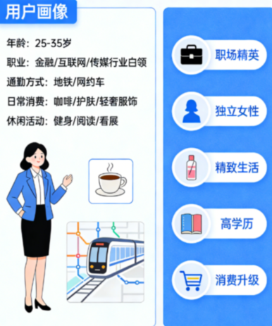

用户画像为产品设计提供了一个统一的用户参照，基于核心用户的画像来设计产品功能。

#### 从哪些维度构建用户画像

从哪些方面来构建用户画像？然后基于用户画像进行需求分析：

1、**基础属性**

从用户的基础属性，也就是用户的静态标签来来做用户需求分析。

一般的基础属性有：

- 年龄

- 性别

- 职业

- 收入

- 教育程度

- 城市等级

- 家庭结构
- 消费结构

从这些标签可以判断用户的市场规模、用户支付能力等。

2、**行为特征分析**

对用户平时一些习惯使用的APP、看的内容等进行收集分析，

- 用哪些APP
- 喜欢看什么内容
- 买东西的决策时长、
- 平时喜欢搜索什么，用什么关键词搜索
- 做事情遇到的障碍和难点

等等这些平时做的事情，一些行为，用来判断用户有什么需求，对某一个需求的强烈程度等。

然后把人群按照行为聚类，按照行为进行分组分析。

3、**动机**

分析用户需求更深层次的原因 -- 动机。

比如用马斯洛的需求分层模型来分析用户需求动机。马斯洛的需求分层模型是分析用户需求底层动机的一个很好的模型。

4、**决策影响**

比如购买某一件商品，有哪些决策因素会影响到用户购买行为。

比如对价格是否敏感，名人言行的影响，KOL的影响（种草行为）。

还有心理因素对行为的影响，这就涉及行为经济学的内容，比如心理账户，损失厌恶等。

5、**情绪层**

在日常生活中，最焦虑哪几件事情？短期时间内有哪些想实现的愿望？

比如一个人怕什么、羡慕谁、晚上回焦虑会想什么事情？

人购物时不是完全理性的，是有限理性，会夹杂情绪、欲望、心理动机等各种复杂因素。

#### 用户画像分析步骤

**第一步：收集数据：**

从哪些地方收集数据呢？用户访谈、问卷调查、产品评论区、微信群等社群聊天记录、搜索指数和搜索关键词、竞品分析、一些产品排行榜、产品发布的网站等等，都可以作为收集数据的来源。

**第二步：行为聚类：**

按照行为特征把收集到的数据进行分类，然后进行分析。

**第三步：核心价值人群：**

那些需求频繁、痛点问题强烈，并且有产品支付意愿和能力的人群，还有要完成的任务紧迫，这些都是产品的核心价值人群。

**第四步：建立画像卡片：**

画像卡片相当于一个用户需求模版，把核心人群的一些需求特征、信息结构化的展现出来。卡片内容结构：

- 基本信息
- 行为特征
- 核心场景
- 主要需求痛点
- 深层动机
- 决策阻碍
- 信任建立，信任来源或信任路径

用上面四步来建立用户画像，然后进行用户需求分析。

#### 用户画像到需求分析

用户画像到用户需求分析的一个步骤：

> 画像场景 → 行为与痛点 → 潜在需求分析 → 产品功能假设(解决方案)

一个例子：

针对“晚上下班后为晚餐忙碌的妈妈”画像：

- **场景**：晚上7：30下班，很累，不想做晚饭，需要在30分钟内搞定全家晚餐。
- **行为**：打开外卖APP，然后频繁切换外卖 App 比价、看评价，选外卖。
- **痛点**：频繁切APP，比价格，看食品评价，决策疲劳，也为食品安全担忧。
- **需求**：需求分析，“快速找到可信赖的、适合家庭的健康套餐”。
- **功能假设**：或者叫解决方案。“家庭套餐”标签 + “妈妈推荐”认证体系。 “妈妈推荐”认证体系是一种信任来源，或者说让用户信任的方法之一。电商里的用户评论，不仅仅是评论，也是一种用户信任来源。

​              

### 场景分析法

场景分析法是以用户使用场景为中心的需求分析方法，从用户遇到问题或要完成任务的真实场景或情境出发，去拆解用户的需求，去深入了解用户需求的本质。它从谁（用户角色）在什么情境或场景下（时间、地点、环境）想做什么（目标与行为），为什么（痛点与动机）如何做（交互流程）的一系列步骤来分析需求。

强调需求不是凭空产生的，而是嵌入到具体的场景中，在具体场景中把所有经历的事情或心理想法活动演绎一遍，发现隐藏的用户痛点、需求、异常情况等。

具体怎么做？可以通过构建特定的场景（比如时间、地点、是什么、做什么任务、为什么做、情感等），深入挖掘用户的真实意图、痛点及潜藏的需求，进而转化为产品需求和功能。

#### 构建场景框架 5W2H

5W1H 是一个优秀的思维框架，也可以用在用户需求分析上，通过回答 Who（谁）、What（什么）、When（何时）、Where（何地）、Why（为什么）、How（如何）、How much（多少）这七个角度来构建一个场景分析框架，去思考用户的需求。

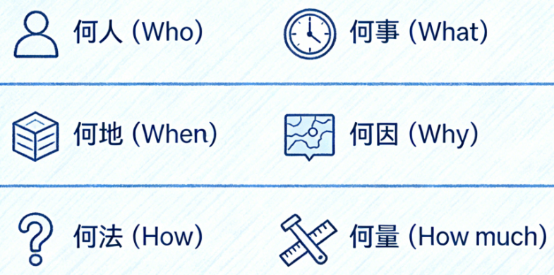

- Who：用户是谁、利益相关者是谁、目标群体是谁。确定用户是谁，才能更好更准确理解相关用户的需求。对用户分类，用户细分，以此更好理解用户

- What：是什么，明确要解决什么问题，问题的定义，问题范围的界定
- When：什么时候，问题发生的时间节点、时间顺序，问题发生的频率
- Where：什么地方，用户问题发生的地点或范围
- Why：为什么，深入分析问题发生的原因、背景，深究问题发生的根源，从而准确理解用户需求
- How：怎么做，思考问题的解决方法和方案，具体的实施计划和路径规划等
- How much：多少，评估解决问题的资源、成本、时间、效益等，投入产出比，经济效益等

#### 场景触发器

触发器（Trigger）是场景分析中至关重要的一个要素，它定义了场景“何时开始”或“在什么条件下启动”。用户在什么场景下开始产生需求。

触发器是启动一个用例或业务场景的具体事件。下面举一些场景触发的来源：

- 时间触发：在某个时间点，用户需要做什么事情。或者周期性的做某种事情
- 事件触发：发了某件事情后，需要做到某件事情。比如毕业了需要求职，则需要优化简历；职场晋升答辩则需要好的PPT
- 环境触发：环境发生了改变，比如大环境变化了用户的习惯跟着改变了，平台的规则发生了改变，用户所处的环境改变了，行业发生变化了

- 目标触发：定了目标，比如企业年度销售目标，个人年度目标

#### 场景分析法步骤

下面给出场景分析法的一个分析步骤：

1、**流程梳理**

梳理流程：梳理核心业务，避免遗漏关键节点，绘制业务主流程图，区分基本流（正常路径）和备选流（分支）、异常流。

常用分析工具：流程图、泳道图、用户故事地图。

2、**遍历场景**

遍历场景：列出所有可能场景（正常、异常、边缘等），至少覆盖80%高频+高影响场景。

常用分析工具：场景列表、5W1H分析、用户故事。

3、**发现需求/痛点**

发现需求/痛点：多站在用户视角，逐场景找出问题、挑战、期望，多问问“用户会卡在哪里？为什么卡？有什么感受？”等问题。

常用分析工具：场景—挑战表格、用户访谈记录等。

4、**提炼功能**

提炼功能：总结、提炼出产品的功能，将需求、痛点转化为可落地的产品功能需求 + 非功能需求，并排序优先级，功能描述要可验证、可衡量。

常用工具：需求规格表、PRD、MoSCoW需求优先级排序。

### JTBD(Jobs To Be Done)

#### JTBD介绍

Job To Be Done 是一种需求分析框架，“因果动机”的思考框架，其核心思想是：

> **用户“雇佣”产品来完成某个特定任务、工作或取得某种进步，而非为了产品本身**。
>
> 当你的产品比其它竞品更好地帮助用户完成这个 Job，用户就会持续“续聘你”，反之就会“解雇你”。

它关注用户行为背后的根本动机和情境，它把用户需求从用户要什么功能提升到用户到底在试图让生活/工作发生什么样的进步，这个层面思考上。

JTBD核心公式：

> 用户想要 [达成某个目标/解决某个问题] ，在 [特定情境] 中，但面临 [障碍] ，因此“雇佣” [你的产品] 来完成任务。

关键要素：

- 任务/目标：用户想要实现的根本目标（如“Java面试简历通过HR”）。
- 情境：触发任务的具体环境
- 障碍：阻止用户自行解决问题的痛点
- 解决方案：被“雇佣”的产品/服务。产品的功能

#### JTBD分析法

**第一步：定义任务或目标，而非用户**

有的需求分析比如用户画像，从用户出发进行分析。而 JTDB 是从完成任务或目标出发。

比如功能性任务， 打车服务，快速从A地点到大B地点。

比如买豪车，不仅是为了出行这个基本功能，更具有社会功能，身份象征和社交门槛，还有成就感以及面子。

**第二步：深挖情境与问题**

在什么情形下，发生什么事情。

在什么情况下，触发了什么事情。

做什么，遇到了哪些困难。

比如做饭耗时，还要洗碗，就诞生了外卖。

把这些情境下发生的事情或问题，收集起来，填进表格进行分析。

可以用 “当……我希望……以便……”句式来提炼任务。

**第三步：设计功能**

产品要设计什么样的功能才能帮助用户完成 job 任务。

### 用户故事

用户故事是一种轻量级的需求捕获方法，其核心在于从用户角色的视角出发，描述其希望达成的目标以及该目标背后的商业价值。它不仅是需求的记录形式，更是一种促进对话、鼓励协作的思维方式。

**用户故事的结构**：

经典的用户故事遵循下面的格式：

- **角色 :** “作为 [某类用户角色]”
- **目标或活动:** “我想要 [执行某个操作或达成某个目标]”
- **价值:** “以便于 [实现某种价值或收益]”

> 英文：
> As a <Role>, I want to <Activity>, so that <Business Value>.
> 中文：
> 作为一个<角色>, 我想要<活动>, 以便于<商业价值>

比如：“作为一名**普通消费者**，我**想要通过商品名称或图片快速搜索到想要的商品**，以便于**节省浏览时间，快速完成购买**。

这个简单句子清晰地定义了谁、要做什么、以及为什么重要。价值部分的明确，也有助于在开发过程中做出正确的权衡。

### 用户故事地图

#### 用户故事地图介绍

单个用户故事是碎片化的，用户故事地图（User Story Mapping） 是 Jeff Patton 在2014年《User Story Mapping》一书中系统化提出的需求可视化组织与规划方法。它将用户故事按照用户旅程（User Journey）的时间线横向展开，按需求细节程度纵向分层，形成一张二维可视结构化的地图。

- 横向（用户旅程）：按时间或流程顺序排列，用户完成一个目标或任务所经历的主要阶段。如电商购物：搜索商品 -> 选择商品 -> 下单 -> 支付付款 -> 等待收货。
- 纵向（需求层次）：在每个阶段下，从上至下排列用户活动（大颗粒度的任务）、用户任务（具体用户故事，中粒度的任务）和在细分（到开发，验收标准、技术任务，细粒度的任务）。

用户故事地图从用户视角而非系统视角理解需求，可以看到全貌的用户使用产品功能地图而非零散的功能点，促进团队对需求理解的共识。

下面这张图来自boardmix博思白板，在线教育平台用户故事地图案例：

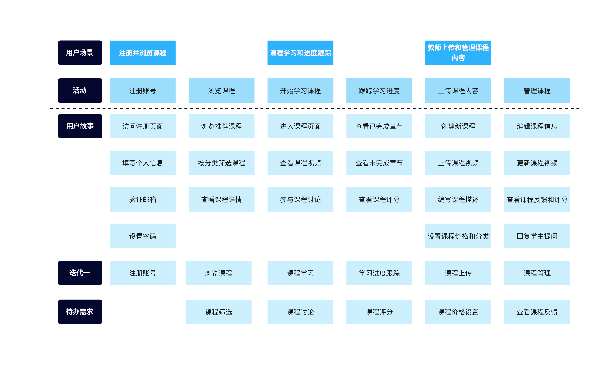

（图片来自 boardmix博思白板 用户故事地图案例模板）

#### 用户故事地图分析步骤

用用户故事地图来分析和组织用户需求的一般步骤。

1、**确定目标 / MVP目标**

明确这次用户地图要解决的一个用户主要目标。

例如：让新用户完成第一次租房看房预约的目标任务。

2、**找出主要用户角色**

先聚焦 1–2 个最核心角色的分析。

3、**梳理用户活动/任务**

- 用动词开头，最上面的一行文字概括（大便签/大卡片）

- 从用户视角叙述完整流程，不要写系统功能。

  例如：寻找房源 → 比较房源 → 联系房东 → 预约看房 → 看房 → 决定租房 → 签约缴费 → 入住管理

4、**在每个活动下的用户故事（纵向堆叠）**

- 用“作为… 我希望… 以便…” 或更简短的短语。

先写出来所有能想到的用户故事，不需要纠结完整性。

5、**纵向排序优先级（从上到下越来越可选）**

主要思考 2 个问题：

- 没有这个用户故事，用户还能完成目标吗？
- 这个用户故事对目标的贡献有多大？

6、**横向划发布范围（Release发布）**

发布Release1、Release2、... ...，每个Release 都要能走通一条端到端流程的用户价值路径。

7、**验证 & 迭代**

小步快跑，功能迭代，验证价值。

### 用例（Use Cases）分析

用户故事是描述用户想要什么，从用户视角来进行需求分析。

那用例分析则更多的是定义系统如何与用户协作和交互。用例描述的是参与者（可以是人或其他系统、子系统）与待构建系统之间，为达成特定目标而进行的一系列交互序列和关系，如泛化、关联、依赖等。

用例通常通过一个参与者（Actor 谁）向系统发出请求-要做什么，系统根据参与者的请求条件做出不同的反应，在不同的条件下，执行某一行为序列，系统怎么满足用户的需求。每一个行为序列可以称之为一个场景，一个用例可以包含多个场景。一个场景也可以称之为用例的一个实例。

**用例的核心元素组成**

一个完整的用例描述通常包括以下几个部分：

*   用例名称：描述用例的意图和目标，反映用户目标的动词短语，如“提交订单”。
*   参与者：发起交互、期望获得价值的主体，Primary Actor，系统的参与者。
*   范围：用例发生的范围，参与者与系统发生交互有一个场景和边界。
*   触发器（Trigger）：标识启动用例的事件，可能是系统外部事件，也可能是系统内部事件，也可能是流程第一个步骤。
*   前置条件：执行用例前系统必须满足的状态。
*   基本事件流：描述最理想的交互路径，流程发生各步骤、事件发生的序列。
*   扩展事件流：描述异常、分支或错误情况下的处理路径，或偶尔发生的场景。
*   后置条件：用例成功执行后系统达到的状态条件。
*   特殊需求：与用例相关的其它规则、实现约束、非功能性需求等。
*   扩展点：对当前用例的扩展，与它存在关系的其它用例引用。

**UML 用例图**

用例图是统一建模语言UML的一部分图，它以图形化方式描述系统功能范围。

用例图构成的四个元素：

> 参与者（角色）、用例、系统边界、元素之间的关系。

除此之外，用例图中还可以包含注解和约束。

1、**参与者 Actor**

参与者指与系统交互的用户或其他软硬件系统 、子系统、外部用户等。

在 UML 中，参与者用人形的图形来表示：

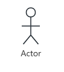

2、**用例 Use Case**

用例，从外部看，指的是可见的系统功能。对系统提供的功能和服务进行描述。

用例，从参与者看，表示参与者为完成某个目标的一系列活动。

用例分析是业务分析、需求分析与产品设计过程的基本单位，粒度可大可小。

在 UML 中，用例使用椭圆图表示：

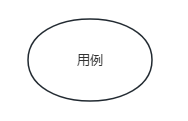

3、**系统边界**

系统边界指系统与系统之间的界限。那什么是系统？这里说的系统是由一系列元素相互作用形成功能的一个整体。一个系统可能是大系统，也可能是子系统，子系统是更大系统的一部分。

在 UML 中，系统边界在用例图中用方框图 + 系统名称来表示，参与者画在边界的外面，用例画在边界里面。

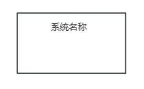

4、**元素之间关系**

这里元素之间的关系有参与者与用例、参与者之间、用例之间的关系。

用例图中有 4 种关系：关联，泛化，包含，扩展。

- **关联关系**：参与者与用例之间的关系。一般是参与者指向用例。也有用例指向参与者，比如推送消息给用户。

用实线剪头表示 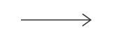

- **泛化关系**：参与者之间或用例之间的关系。一种继承关系。比如父用例可以被多个子用例实现，那么父用例和子用例就是泛化关系，子用例继承了父用例的所有行为、属性和关系，当然，子用例还可以添加、覆盖父用例的行为。如果是程序员，用java编程中的父类和子类（继承关系）来理解，就很容易理解。

用例中泛化关系图：实线 + 空心箭头 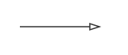

- **包含关系**：用例之间的关系。包含关系指一个用例可以包含一个子用例，并把它所包含的用例行为作为自身行为的一部分。

在UML中，包含关系图：带箭头的虚线段 + << include >>字样来表示：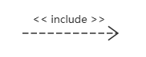

下图表示包含关系，基础用例指向被包含的用例图：

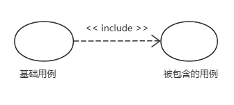

啥时候用包含关系：

1、多个用例用到同一种行为，则可以把这个共同的行为单独抽象为一个用例，让其它用例包含这一个用例。

2、当某一个用例功能过多、事件流过多，可以把某一段事件流抽象为一个被包含的用例，达到简化描述的目的。

- **扩展关系**：表示用例之间的关系。把新的行为加入到已有的用例当中，获得的新用例叫做扩展用例，原有的用例叫基础用例。

在UML中，扩展关系图：包含关系图：带箭头的虚线段 + << extend >>字样来表示：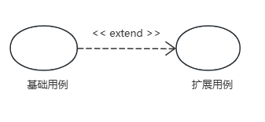

## 参考

- 《用户故事地图》作者：Jeff Patton https://book.douban.com/subject/26760348/