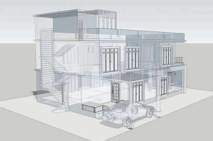
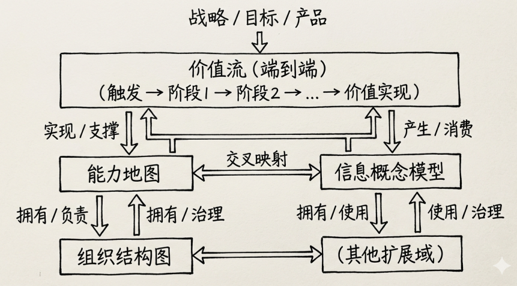
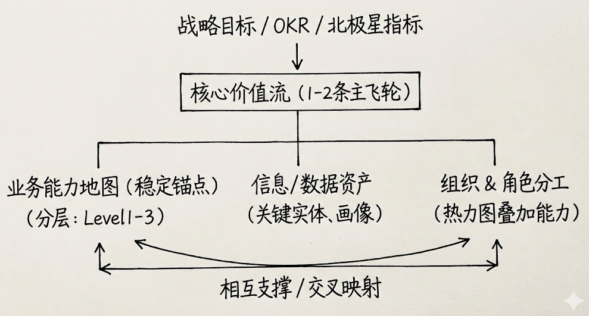

## 前言

在前面文章 [了解企业架构](https://www.cnblogs.com/jiujuan/p/16871889.html) 中可以了解到，业务架构是企业架构的中间层，连接了企业战略和技术实现，具有承上启下的重要作用。

那业务架构到底是什么？它的构成元素有哪些？等等，下面一一分析。

 ## 业务架构概念

在完成了业务分析，我们理解了利益相关方的述求，梳理了用户故事与业务流程，识别了核心业务能力和价值流，也梳理出了一些功能和非业务功能，等等，做完这些之后，如何将这些对业务的理解，系统性、结构化的进行转化，使它们能够指导 IT 投资、应用系统构建、产品构建的可靠蓝图，从而创造价值，这就涉及到业务架构。

业务架构是企业为创造价值而进行的核心业务要素及其相互关系的结构化表达。它描述了企业的业务战略、组织结构、流程和能力如何协同工作，以实现业务目标。简单来说，业务架构是将业务战略转化为可操作的蓝图。

它有点类似建筑结构图概念：

业务架构强调：

- 战略对齐：确保业务活动支持企业的愿景和目标。
- 整体视角：提供企业级视图，避免部门孤岛。

业务架构需要回答的是：

*   我们靠什么能力参与竞争？企业能做什么？（业务能力）
*   我们为谁（利益相关方）创造价值，价值如何流动？（价值流、利益相关者）
*   我们的业务由哪些关键部分构成，它们如何协作？（业务组件、信息与组织关系）
*   驱动我们决策的核心规则是什么？（业务策略与政策）

## 业务架构的构成元素

业务架构的构成元素如下：

- 业务战略与目标（Business Strategy and Objectives）：顶层驱动因素，包括愿景、使命和KPI
- 业务能力（Business Capabilities）：企业需要具备的核心能力，即“企业能做什么”。它是稳定、不依赖技术的抽象描述。
- 价值流（Value Streams）：从客户视角描述端到端的价值交付过程，包括触发事件、阶段和输出。
- 组织结构（Organization）：企业的角色、部门、责任、职责之间的关系。
- 业务流程（Business Processes）：详细的操作步骤和活动，支持价值流的实现。
- 信息概念（Information Concepts）：业务中涉及的关键数据实体和关系。

这些元素不是孤立的，而是通过相互作用，共同实现企业目标。

能力 → 价值流阶段：能力是静态的什么能做，价值流是动态的怎么做。

战略驱动价值流 → 价值流依赖能力 → 能力由组织实现 → 组织操作信息 → 信息反过来支撑能力成熟度提升。

业务架构是**战略执行的操作化蓝图**。它将“成为行业客户体验领导者”这样的战略意图，分解为：需要具备全渠道客户洞察、个性化服务编排等核心能力，并进一步定义这些能力之间的关系。

从而为后续的 IT 系统划分（应用架构）和技术选型（技术架构）提供直接、可信的依据。也就是我们常说的业务是技术架构的根基。

## 业务架构概念简图

一页纸来画出业务架构概念简图

## 与相关概念区别

**业务分析**

业务分析侧重于理解、发掘和定义具体的业务需求与问题，即“问题域”。业务架构则在此基础上，进行抽象、归纳和结构化，定义出业务构成的基本模型，即开始定义“解”的稳定结构，（解-解答域，解决方案）。前者是后者的重要输入。

**流程管理**

流程管理关注动态的活动流、流程步骤  – 工作是如何一步步完成的。

业务架构关注静态的能力与组件 – 完成工作需要哪些稳定的“器官”和“资源”。流程会频繁优化变化，但支撑流程的业务能力相对稳定。

**应用架构**

这是最易混淆的一对。**业务架构定义业务是什么**，它使用业务语言（如客户、产品、订单）。**应用架构定义系统如何支持业务**，它使用技术语言（如客户关系管理系统、订单服务、主数据服务）。业务架构中的订单履约能力，可能对应应用架构中的订单处理系统、库存系统和物流调度系统等多个应用组件的协作。

## 业务架构的价值

**对企业的战略价值：从模糊到清晰，从失焦到对齐**

- **战略解码与落地**：它使模糊的战略变得可执行。通过将战略目标映射到需要增强或新建的业务能力上，在映射到相关价值流和业务流程上，企业能够清晰地规划能力建设路线图，确保每一笔IT投资都直接贡献于战略目标的实现，极大避免了资源浪费在边缘或孤立的项目上。
- **优化运营与消除冗余**：通过全局的业务组件视图，企业可以一目了然地发现不同部门或业务线中重复建设的相同能力（如每个产品线都自建客户信息管理模块）。这为能力整合、共享服务建设提供了依据，从而降低运营成本、提升数据一致性、提升效率。这也是共享平台、中台建设的一个依据。
- **驾驭复杂性**：对于大型集团或多元化企业，业务架构提供了作战地图，帮助管理层理解庞杂业务的内在逻辑与依赖关系，从而做出更明智的兼并、剥离或重组决策。
- **促进业务创新与敏捷**：当业务被抽象为一组定义清晰、接口明确的能力积木块时，组合创新变得容易。要推出一个新业务产品或进入一个新渠道，可以快速评估需要组合哪些现有能力、需要新建哪些能力，极大地加速了业务创新的周期。

**对业务部门的运营价值**

*   **统一的沟通语言**：业务架构在业务部门之间、业务与IT之间建立了一套基于业务能力、价值流和业务对象的通用语言。这彻底改变了业务说业务话，技术说技术话的沟通困境，减少了误解，提升了协作效率。为后续的技术架构设计和开发奠定了基础，如DDD。
*   **清晰的职责界定**：通过定义业务组件及其归属，可以更清晰地划分业务部门的职责边界，减少灰色地带和推诿，使端到端的价值流能够顺畅地跨越部门壁垒。
*   **变革影响分析**：当需要调整某项业务政策或进入新市场时，业务架构模型可以像冲击波模拟器一样，帮助分析这一变化将影响到哪些业务能力、流程和信息系统，使得变革管理更具预见性和可控性。

**对IT组织的技术价值**

- 需求变更溯源：任何一个功能需求（用户故事）或变更请求，都可以追溯回其支撑的业务能力与价值流阶段。这让 IT 能够判断需求的战略优先级，并理解其完整业务上下文，从而做出更合理的技术权衡。把技术开发中的需求变更提高到了更高层次认知。

- 系统边界划分：这是业务架构对后续技术架构最直接、最重要的贡献。以高内聚的业务能力或业务组件作为划分微服务、子系统的边界，能够最大程度地保证系统与业务同步演进，降低系统间的耦合度。

  康威定律在此可以被积极运用：首先设计理想的业务架构（反映期望的业务协作模式），然后依此重组团队结构，团队自然能构建出与之匹配的IT系统。

- IT投资与组合管理：IT 项目组合和资产（应用系统）可以映射到它们所支持的业务能力上。这使得企业能够直观地看到：哪些能力得到了过度投资（多个系统功能重叠）？哪些是关键能力却依赖着脆弱的老旧系统（技术风险）？从而科学规划现代化改造的优先级。

- 促进敏捷与DevOps：清晰稳定的业务能力边界，为组建长期、全功能的特性团队提供了理想范围。一个团队可以围绕一个或几个紧密关联的业务能力，端到端地负责其需求、开发、测试和运维，实现真正的业务敏捷。

## 分析例子：互联网产品

互联网产品/软件开发行业（典型如SaaS平台、电商平台、内容/社交App、在线工具类产品）的业务架构，其构成元素之间的互动关系与通用框架，会更突出用户增长、数字化体验、数据驱动、快速迭代等互联网特征。

下面用一个典型的中大型SaaS/互联网平台公司（例如：项目管理SaaS、电商SaaS后台、在线教育平台等）的简化真实例子，来展示四个核心域（能力、价值流、组织、信息）的关键内容，以及它们之间的映射关系。

### 1. 核心价值流示例

最典型的价值流：“潜在用户/细分用户 → 付费客户 → 持续续费/扩展使用”。

互联网产品最常见的一条主价值流：

> 发现与吸引 → 注册与首次体验 → 激活与深度使用 → 转化付费 → 持续价值交付 & 续费/扩展

这条价值流体现了互联网产品的商业逻辑：获取 → 激活 → 留存 → 变现 → 持续扩展与续费。

### 2. 核心业务能力

互联网/SaaS公司常见能力地图（简化版例子，按层级）：

- 战略层 / Level 1
  - 用户增长与获取
  - 产品研发与迭代
  - 用户成功与留存
  - 商业变现
  - 平台运营与生态

- 核心执行层 / Level 2
  - 内容/功能推荐与个性化
  - 用户行为分析与洞察
  - A/B 测试与实验平台
  - 多租户 SaaS 基础设施管理
  - 支付与订单管理
  - 客户成功（Onboarding、续费辅导）
  - 社区/生态运营
  - 数据中台与 BI 分析

### 3. 组织单元

​              

## 参考

- https://www.cnblogs.com/jiujuan/p/16871889.html  了解企业架构EA(Enterprise Architecture)