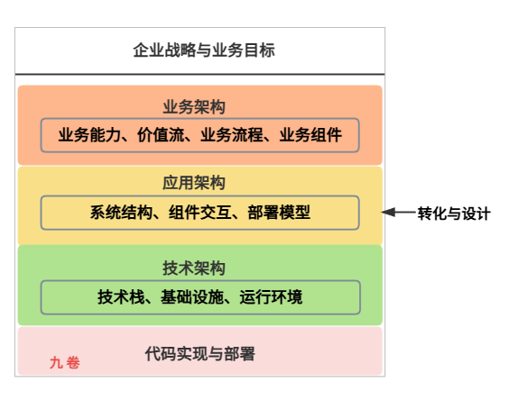

## 一、应用架构的本质

在完成了业务架构的蓝图绘制之后，我们站在了一个关键的技术转化点上。业务架构告诉我们需要构建什么，而应用架构则定义如何将这些业务需求组织成可行的软件系统。

如果说业务架构是城市的总体规划，那么应用架构就是这座城市的结构骨架——决定了高楼大厦如何布局、交通网络如何连接、功能区如何划分。

### 应用架构的定义

应用架构是关于软件系统如何被结构化，以实现业务功能和质量属性的高层设计。它定义了系统的组成部分、它们之间的交互关系、以及这些部分如何被组织以实现系统的整体目标。应用架构不关注具体的代码实现或技术细节，而是关注系统的宏观结构和组织原则。

用更形象的话说：应用架构回答的是“系统由哪些**块**构成，这些**块**如何拼在一起工作”的问题。

从企业架构的宏观视角来看，应用架构是 IT 战略中基于应用视角的产物，它以应用的视角阐述各信息系统之间的关联。应用架构源自业务架构，服务于业务架构，是基于业务架构的梳理分析和共性抽象，形成的覆盖业务架构的 IT 信息系统。

### 应用架构的4个核心关注点

**第一 结构分解**：如何将复杂的软件系统分解为更小、更易管理的单元（如应用、组件、服务、模块）。

**第二 交互协作**：划分的这些应用、组件、服务、模块之间如何通信、协作和传输数据。

**第三 职责分配**：每个单元承担什么职责，业务逻辑如何分布在这些单元中。单元之间如何相互影响最小。

**第四 质量保障**：如何通过结构设计来满足性能、可扩展性、可维护性等非功能性需求。

应用架构产出物有架构图、接口API规范设计、应用部署图、设计原则与约束、技术选型等。

## 二、 应用架构起着承上启下作用

应用架构在整体架构中处于业务架构与技术架构之间，扮演着至关重要的转化和桥梁角色：

**承上（来自业务架构）**：

- 从业务组件到软件组件：业务架构中定义的业务组件，是应用架构中服务或模块划分的直接依据。

- 从业务流程到系统交互：业务架构中描述的跨组件流程，转化为应用架构中服务间的调用关系和数据流

- 从业务目标到系统特性：业务架构中的业务目标（如“快速响应”），转化为应用架构中的设计目标（如“服务响应时间<100ms”）。

**启下（通往技术架构）**：

- 从组件到技术实现：应用架构中定义的组件和交互模式，决定了需要哪些技术能力来支撑（如消息队列、API网关、数据库）。
- 从质量需求到技术方案：应用架构中要求的质量属性（如高可用性），转化为具体的技术方案（如多区域部署、故障转移机制）。
- 从抽象到具体：应用架构将抽象的软件结构具体化为可由特定技术实现的设计方案。

## 三、应用架构设计框架

### TOGAF框架详解

TOGAF（The Open Group Architecture Framework）是目前全球应用最广泛的企业架构框架，根据统计，80%的福布斯全球排名前50的公司都在使用TOGAF。TOGAF是一个行业标准的体系架构框架，能够被任何希望开发信息系统体系架构的组织自由使用。TOGAF的基础是美国国防部的信息管理技术架构（Technical Architecture for Information Management，TAFIM），它基于一个迭代的过程模型，支持最佳实践和一套可重用的现有架构资产。

TOGAF的核心是架构开发方法（Architecture Development Method，ADM），这是一个可靠的、行之有效的方法，用于发展能够满足商务需求的企业架构。ADM是一个迭代的步骤顺序以发展企业范围的架构的方法，包含八个主要阶段：架构远景→业务架构→信息系统架构→技术架构→机会与解决方案→迁移规划→实施治理→架构变更管理。这种迭代的方法论强调从战略到实施的闭环管理，使得架构设计能够不断适应业务需求的变化。

TOGAF的内容结构主要包括七个部分，其中核心是架构开发方法（ADM），通过架构能力运用ADM方法，ADM方法由一系列指南和技巧进行支持。架构开发过程产生的架构内容框架提供了详细的架构工件模型，包括交付物、交付物的工件和架构构建块。参考模型提供了两个参考模型：技术参考模型（TRM）和集成信息基础设施模型（III RM）。

### Zachman框架解析

Zachman框架是第一个最有影响力的架构框架方法论，由John Zachman在1987年首次提出。Zachman框架为企业提供了一种用来组织描述数据以及为其分类的逻辑架构，它不是一种框架，而是一种组织构架工具，用于设计文档、需求说明和模型的工具。Zachman框架的核心在于将企业架构分解为六个不同的视角，包括范围模型、企业模型、系统模型、技术模型、详细模型和功能模型。

Zachman框架模型分两个维度：横向维度采用6W（What、How、Where、Who、When、Why）进行组织，纵向维度反映了IT架构层次。通过"谁（Who）""什么（What）""何时（When）""何地（Where）""为何（Why）""如何（How）"六列，结合"规划者""业务主""系统设计者""技术设计者""开发者"五行，定义企业架构的多维视图。这种矩阵式的分析方法能够从不同角度全面理解企业架构，确保架构设计的完整性和系统性。

### 框架对比与协同

TOGAF与Zachman框架在核心定位上有所不同，TOGAF是方法论驱动，强调实施流程，而Zachman是模型驱动，强调结构化分析。TOGAF提供可落地的实施步骤，适合快速构建架构蓝图，广泛应用于大型企业，生态工具支持成熟；Zachman提供全局视角，适合企业架构的系统性分析，是早期IT规划的经典框架。在实际应用中，许多组织会结合使用这两个框架，Zachman用于多角度分析，TOGAF用于具体实施步骤的指导。

## 四、应用架构设计方法与原则

### 核心设计原则

应用架构设计应遵循五大核心设计原则。

首先是**业务适配性原则**，应用架构要支撑和提升战略能力和业务能力，服务于企业的战略目标。

其次是**规范性原则**，遵循企业信息一体化平台建设要求，遵循IT建设的相关规范，在方法和内容上可以有所创新。

第三是**柔性原则**，按照分层逐步细化的设计理念，建设层次化及柔性的应用架构，保持其独立于具体解决方案与技术实现，设计成支撑业务实现的灵活、可拓展的架构。

第四是**行业领先原则**，应用架构整体设计要参考行业架构领先实践，在现有应用架构的基础上有所提升，吸纳业界领先架构思想和实践。

第五是**成熟实践原则**，具体应用组件和功能设计需要参考成熟套装软件包。

除此之外，应用架构设计还需要遵循软件架构设计的基本原则。

**单一职责原则**要求每个模块或组件应该具有清晰的单一功能，每个模块或函数应只负责一项功能，即只有一个引起变化的原因。

**开放封闭原则**要求系统架构应该对扩展开放，但对修改封闭，即在不修改现有代码的基础上增加新功能。

**依赖倒置原则**指出高层模块不应依赖于低层模块，两者都应依赖于抽象，抽象不应依赖于细节。

### 模块化设计方法

模块化设计是应用架构的核心方法之一，旨在将系统分解为独立的、可重用的模块，每个模块负责特定的功能，以提高系统的可维护性和可扩展性。

模块间通过定义良好的接口进行通信，减少模块间的依赖，增强系统的模块独立性。采用模块化设计可以便于系统的迭代更新，降低系统整体的风险，同时也有利于促进软件工程中的代码复用。

模块化设计原则的实现需要考虑以下几个方面：

- 首先是接口设计，模块间通过定义良好的接口进行通信，接口应该小而专一，而不是大而全。

- 其次是依赖管理，通过依赖倒置原则，降低系统各部分之间的耦合，提高系统的灵活性和可扩展性。

- 第三是职责划分，每个模块、类或函数应只负责一项功能，即只有一个引起变化的原因。

### 架构风格选择

选择适合系统需求的架构风格是应用架构设计的关键。

常见的架构风格包括分层架构、微服务架构、事件驱动架构和中间件架构等。

分层架构将系统划分为不同的层次，每个层次负责不同的功能，常见的分层架构包括三层架构和MVC架构。

微服务架构将系统拆分为多个小型的、独立的服务，每个服务独立部署和扩展。

事件驱动架构允许系统内各个组件通过事件进行通信和交互。

对于大规模企业级应用，可采用微服务架构，这种架构风格能够提供更好的可扩展性和灵活性。对于小型应用，MVC可能更加适合，它能够快速构建应用并保持代码的结构清晰。

在选择架构风格时，开发团队需要评估项目的规模、需求和技术要求，从而选择最适合的架构风格。

## 五、应用架构设计的步骤

### 架构目标

应用架构设计的第一个步骤是确定架构目标。清晰的目标能让你更好地考虑并解决架构相关问题，正确的目标能让你知道什么时候该结束，什么时候该迈向下一步。在设定架构目标的时候需要考虑以下基本点：首先是从一开始就要对架构目标有个清楚的认识，架构与设计的各个阶段所花费的时间将取决于这些目标，比如是在搭建一个原型、测试潜在的方式还是准备为新应用创建一个长远的架构环境。

其次是了解架构的消费者，要确定架构是否会被其他设计师、开发人员、测试人员、业务人员或管理人员使用。确定架构受众的需求，可以让架构更为成功、更有影响力。

第三是了解条件限制，了解技术限制、使用限制和其他限制条件，这些因素都会影响架构的设计决策。

### 识别关键场景

第二个步骤是识别关键场景。使用关键场景来帮助确定最重要的因素以及对可用架构做出评估。关键场景是指那些对业务成功最为关键的应用场景，这些场景通常具有高频率、高价值或高风险的特点。通过分析关键场景，可以识别出架构设计中需要重点关注的质量属性，如性能、可用性、安全性、可扩展性等。

关键场景的识别应该与业务利益相关者密切合作，确保架构设计能够真正支撑业务目标。同时，关键场景也可以作为架构评估的依据，在架构选择和决策时提供参考。

### 了解应用

第三个步骤是对应用的深入了解。了解应用类型、部署架构、架构特点及相关技术，以让你的设计更符合实际。这包括了解应用的业务背景、技术环境、部署要求等。应用类型不同，架构设计的要求也会有所不同，例如面向用户的应用与面向后台处理的应用在架构设计上会有显著差异。

部署架构的了解包括应用将要部署在什么样的基础设施上，是本地部署、云部署还是混合部署。架构特点的了解包括应用是否需要支持高并发、是否需要分布式处理、是否有特殊的性能要求等。相关技术的了解包括团队熟悉的技术栈、可用的技术选型等。

### 确定主要风险点

第四个步骤是确定主要风险点。根据质量属性与架构框架确定主要的风险点，这些风险是在设计应用的时候最容易出错的地方。风险点可能是技术难点、高风险模块或者容易产生问题的地方。通过提前识别这些风险点，可以在架构设计中采取相应的预防措施，降低项目风险。

质量属性包括性能、可用性、安全性、可扩展性、可维护性等，不同的质量属性在不同的应用场景中重要性不同。架构框架提供了分析质量属性的方法论，例如ATAM（架构权衡分析方法）可以用于评估架构在多个质量属性之间的权衡。

### 创建可选方案

第五个步骤是创建可选方案。创建备用架构或架构测试点并按场景、危险区域、部署条件对其进行评估。随着设计的发展，会逐渐发现越来越多的影响架构的细节，架构也因此逐渐丰满起来。别想一步就完成整个架构的构建，也别被细节迷惑，要先为架构设计一个基本框架，把注意力放在主要步骤上。

可选方案的创建应该涵盖多种可能的架构选择，包括不同的架构风格、不同的技术选型、不同的部署方案等。对每个可选方案进行评估，比较其在关键场景、危险区域和部署条件下的表现，最终选择最适合的架构方案。

## 六、 应用架构设计师的角色与技能

作为应用架构师，需要具备以下核心能力：

1. **抽象思维**：能够从具体需求中抽象出通用模式和结构。
2. **权衡决策**：在相互冲突的目标（如性能vs.可维护性）间做出明智选择。
3. **沟通能力**：向不同受众（开发者、业务人员、管理者）解释架构设计。
4. **技术广度与深度**：了解多种技术方案，并在关键领域有深入理解。
5. **演进思维**：将架构视为演进中的生命体，而非一成不变的设计。
