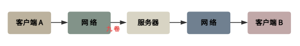
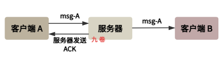

IM即时通讯系统消息可靠传输技术方案

## 一、消息可靠传输的核心挑战

在 IM 即时通讯系统中，消息的可靠传输是用户体验的基石。

用户希望自己发送的每一条消息都能准确无误地送到目标接收者，且不会出现消息丢失、重复、乱序等问题。然而，现实网络环境的复杂性，使得这一目标的实现面临很多挑战。

主要问题有：

- 丢掉消息（网络断开、服务挂掉等）
- 重复消息（重复发送消息）
- 消息乱序（消息发送顺序乱了）

为什么会有这些问题？

首先因为，TCP 协议虽然提供了可靠传输机制，但这仅限于单次连接的可靠性，当连接中断重连后，TCP 无法保证之前未确认的消息状态。其次，服务器端在处理高并发消息时，可能因为负载过高、程序异常或重启等原因导致消息处理中断。此外，客户端与服务器之间的网络可能经历多次切换和中断，每次重新连接都需要考虑消息同步问题。最后，分布式系统架构下，消息可能经过多个节点处理，每个节点的状态同步和故障恢复都是潜在的风险点。

从系统架构的角度看，消息可靠传输需要解决三个核心问题：

消息发送的可靠性（发送方确认消息已被服务器接收）、消息存储的可靠性（服务器确认消息已持久化保存）、消息送达的可靠性（接收方确认消息已被获取）。这三个环节环环相扣，任何一个环节出现问题都可能导致消息丢失或重复。理解这些挑战是设计可靠消息传输方案的前提，而不同的业务场景和技术约束则决定了最终方案的选择。

消息在 IM 链路系统中的经历路径：

## 二、消息防丢失技术方案

### ACK确认机制与重试策略

**ACK 确认机制**：

消息防丢失的核心机制是建立完善的确认（ACK - Acknowledgement）机制。

在一个 IM 系统中，消息发送后需要建立多个确认环节：

客户端发送消息后等待服务器的接收确认（Server ACK），服务器将消息持久化后向发送方返回存储确认（Store ACK），服务器将消息推送到接收方后等待接收方的送达确认（Deliver ACK）。

发送方发出消息后，会等待服务器的“已接收确认”（ACK）。同时，接收方在成功收到服务器转发的消息后，也会发回一个应用层 ACK。只有收到最终的送达 ACK，发送方才确认消息被对方收到。与此对应，如果接收方发现消息丢失或损坏，会发送NACK（否定确认）请求重发。

比如一个客户端 A 发送消息 msg-A 到服务器端，然后服务器端向客户端 A发送 ACK 确认消息：

这种逐层确认的方式确保了消息在每个处理节点的状态可追溯。

**重传策略**：

ACK 确认机制需要设置合理的 **超时时间** 和 **重试次数**，一般采用指数退避策略（阶梯式延迟）避免网络拥塞。

如果在规定时间内未收到 ACK，发送方会触发重传。为避免网络拥塞，通常会采用指数退避策略（如 1秒、3秒、5秒），并在达到一定次数后停止重传。

消息重发时需要携带序列号，服务器通过序列号判断是否为重复消息，从而避免重复投递。这种本地队列配合重试机制的方案，能够在很大程度上应对网络抖动和临时性故障。

**本地消息队列**：

对于网络不稳定等等原因导致的暂时性发送失败，系统应该实现本地消息队列的机制。

发送方客户端在消息发出后，先将消息存储在本地队列中，状态标记为“发送中”。如果在超时时间内未收到确认，则从本地消息队列中取出消息重新发送。

### 消息持久化与多副本策略

服务器端的消息持久化是防止消息丢失的关键。

接收到客户端消息后，服务器应当先将消息写入磁盘或可靠的存储系统，然后再返回确认给客户端。

这个写入过程可以采用同步写入或异步写入配合 Write-Ahead Log（WAL）机制。同步写入虽然可靠性最高，但对性能影响较大；WAL机制则是先将操作日志写入持久化存储，然后异步执行实际操作，在系统崩溃后可以通过重放日志恢复数据。

为了进一步提升可靠性，大型 IM 系统通常采用多副本存储策略。消息在写入主数据库的同时，异步复制到备用数据库或分布式存储系统中。当主存储节点发生故障时，可以从副本节点恢复数据。

完整的消息状态追踪系统是可靠传输的重要保障。每条消息在系统中都应当有明确的状态标识，如“已创建”“已发送”“已接收”“已送达”“已读”等。服务器需要维护这些状态并在状态变化时及时更新。当消息在某个环节处理失败时，系统应当能够识别并触发补偿机制。补偿机制可以采用定时扫描的方式，检查长时间未推进状态的消息并重新处理，也可以采用事件驱动的方式，在特定条件触发时自动执行补偿逻辑。

在实际工程实践中，还需要考虑消息的优先级问题。

高优先级消息（如系统通知、重要提醒）应当获得更可靠的处理保障，可能采用同步确认和多级重试策略。低优先级消息（如普通聊天消息）则可以适当放宽要求，采用异步处理和有限重试，以提升系统整体吞吐量。这种分级处理策略能够在保证核心功能可靠性的同时，不过度消耗系统资源。

## 三、消息防重复技术方案

### 消息唯一标识体系

防止消息重复的核心是建立完善的唯一标识体系。每条消息都应当具有全局唯一的标识符，通常由客户端生成的UUID、时间戳加随机数组合、或者递增序列号等方式生成。

在消息发送时，客户端为每条消息分配唯一ID，并将该ID包含在消息协议中。服务器接收到消息后，将该ID与消息内容一起存储。在消息处理的各个环节，服务器都可以通过检查消息ID来判断是否为重复消息。

客户端生成唯一ID的方式需要考虑分布式环境下的唯一性保证。一种常用方案是组合用户ID、时间戳、设备序列号、本地递增序号等信息，生成一个几乎不可能冲突的复合ID。
另一种方案是使用UUID算法，其随机性和理论上的重复概率极低。无论采用何种方案，都需要在协议设计时为消息ID预留足够的存储空间，并确保其在整个消息生命周期内保持不变。

### 幂等性处理机制

幂等性是防止消息重复影响系统状态的关键特性。一个操作如果多次执行与单次执行的效果相同，则该操作是幂等的。
在IM系统中，消息的存储和投递操作应当设计为幂等的。服务器在处理消息时，首先检查该消息ID是否已经处理过，如果已经处理过则直接返回成功而不重复执行存储逻辑。对于消息状态更新类的操作，也需要确保重复执行不会改变最终状态。

幂等性设计的具体实现方式包括多种策略。基于消息ID的去重表是最直接的方式，服务器维护一张已处理消息ID的表，新消息到达时先查询是否已存在。版本号机制适用于状态更新操作，每次更新都附带版本号，服务器只接受比当前版本新的更新。基于业务逻辑的去重则更加智能，例如对于消息已读操作，如果消息本身就是已读状态，则重复标记为已读不会产生任何影响。

### 客户端本地去重

除了服务器端的去重机制，客户端也应当实现本地去重功能。客户端在发送消息时会先将消息存储在本地消息库中，并标记为“发送中”状态。
当消息发送失败需要重试时，从本地消息库取出消息重新发送，而不是创建新消息。这样即使重试过程中产生了多条网络请求，最终也只会有一条消息被真正处理。客户端在接收消息时，也应当检查消息ID，如果发现是已接收过的消息，则直接忽略而不重复展示给用户。

客户端本地去重还需要考虑数据同步问题。在多设备登录场景下，同一条消息可能被发送到多个设备，需要确保每个设备都能正确识别和处理重复消息。

- 一种解决方案是使用统一的全局序列号，每个设备根据序列号判断消息是否已处理。
- 另一种方案是在服务器端记录每条消息的投递状态，客户端在拉取消息时通过状态信息判断是否需要展示。

## 四、消息顺序性保证方案

### 单聊消息顺序保证

在单聊场景中，消息的顺序性相对容易保证。如果双方每次只有一方在发送消息，那么消息天然就是按时间顺序的。但实际场景中，双方可能交替发送消息，这就需要通过序列号机制来保证顺序。每条消息都携带一个递增的序列号，接收方按照序列号的顺序将消息呈现给用户。对于乱序到达的消息，可以暂存到缓冲区，等待中间缺失的消息到达后再按顺序处理。

序列号的生成策略有多种选择。一种是基于本地递增的序号，每次发送消息时本地序号加一，但这种方式在跨设备同步时可能出现问题。

另一种是基于服务器的全局序号，服务器为每个会话维护一个递增序号，新消息总是分配当前最大的序号加一。这种方式能够保证全局顺序，但需要额外的网络往返。折中方案是使用混合序号，本地生成序号的同时携带时间戳，服务器在此基础上进行全局排序和校正。

### 群聊消息顺序保证

群聊场景下的消息顺序问题更加复杂。一个群组中有多个发送者，每条消息都需要被所有群成员以相同的顺序接收。一种解决方案是采用单源定序的思想，即所有消息都经过同一个中央节点（群消息服务）进行排序和分发。该节点为所有消息分配全局递增的序列号，然后按照相同顺序推送给所有群成员。这种方式实现简单，但存在单点瓶颈问题。

分布式群消息排序需要引入分布式共识算法。一种思路是使用逻辑时钟（如Lamport时间戳），每条消息携带发送者的逻辑时间戳，消息的顺序由逻辑时间戳决定。

另一种更实用的方案是采用混合逻辑时钟，既保留逻辑时钟的因果顺序保证，又引入物理时间戳用于局部排序。实际系统如微信的群消息系统采用的就是基于服务器单点定序的方案，通过分布式部署多个定序服务节点实现高可用。

### 消息分段与合并处理

在处理长消息或包含附件的消息时，可能需要进行分段传输。分段传输带来了额外的顺序管理挑战。
解决方案通常是在协议层面定义消息分段的元数据，包括分段的序号、总数、消息ID等。接收方需要根据这些元数据将分段组装成完整的消息，只有收集齐所有分段后才能按顺序处理。组装过程中需要处理分段丢失、超时等异常情况。

消息合并是另一种常见的传输优化策略。当用户短时间内发送多条消息时，可以将这些消息合并为一次批量传输，以减少网络往返次数。

合并传输时需要保留每条消息的独立信息，接收方处理时仍然按照各消息的序列号进行排序。这种方式在提升传输效率的同时，对消息顺序保证机制提出了更高要求，需要在合并传输的批量内部和批量之间都保证正确的顺序。

## 参考

- http://highscalability.com/blog/2014/2/26/the-whatsapp-architecture-facebook-bought-for-19-billion.html whatsapp可扩展之路
- https://zhuanlan.zhihu.com/p/411810288  即时通讯系统架构设计-如何设计一款WhatsApp
- https://www.hellointerview.com/learn/system-design/problem-breakdowns/whatsapp whatsapp系统设计中遇到的问题
- http://www.52im.net/thread-3472-1-1.html 从新手到专家：如何设计一套亿级消息量的分布式IM系统
