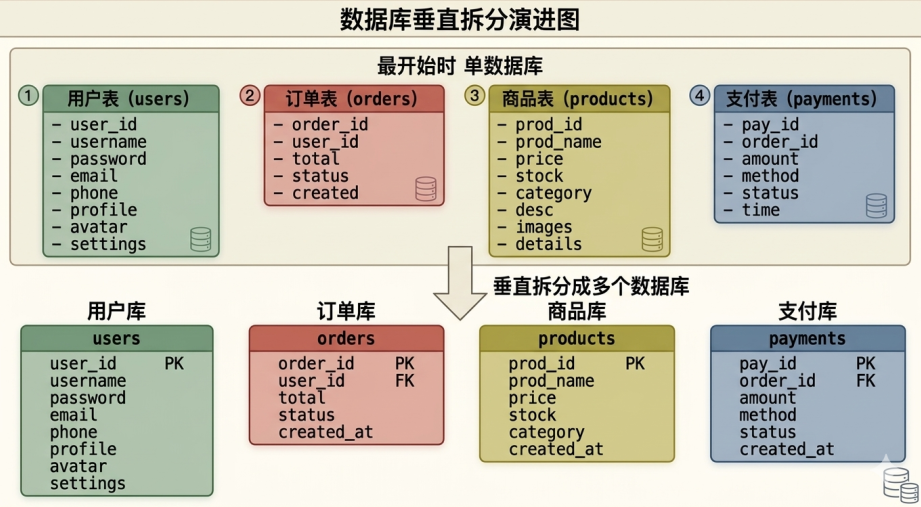
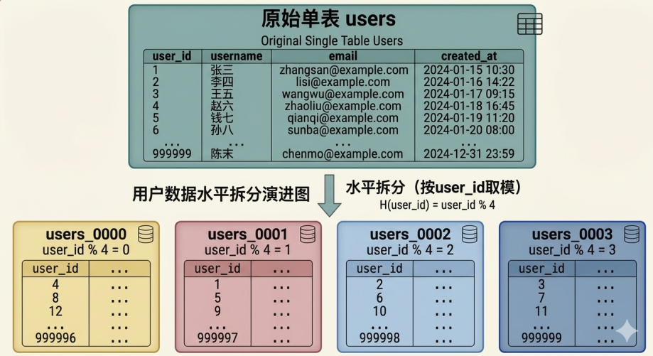
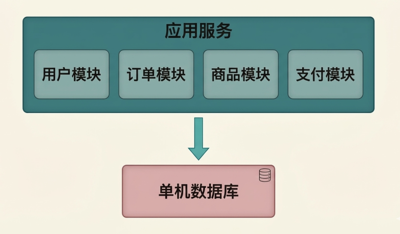
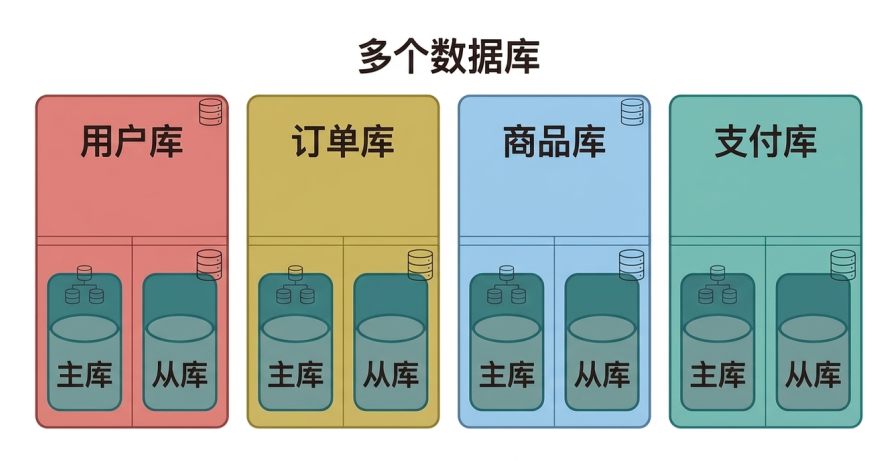
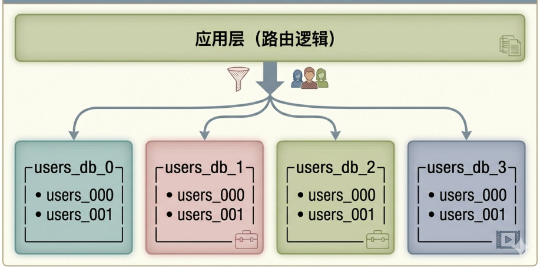
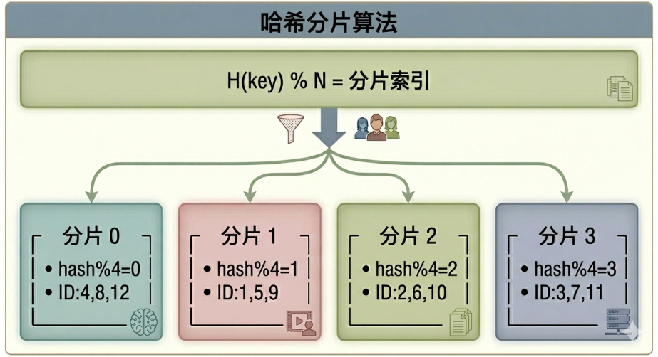
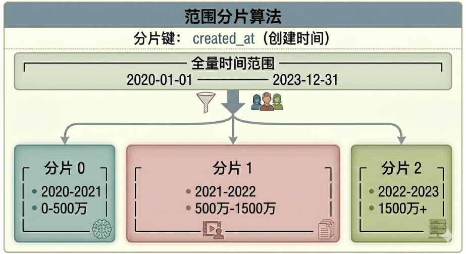
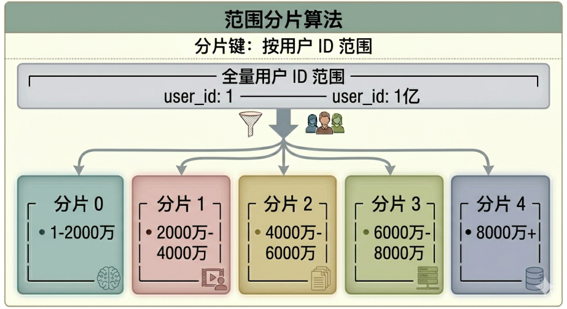
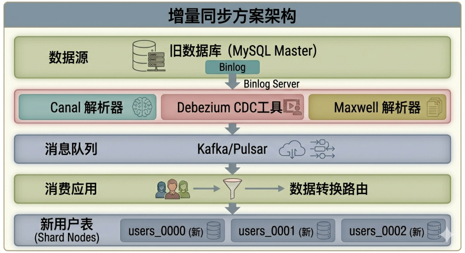

数据库分库分表详细方案讨论

## 一、为什么进行分库分表?时机分析

### 何时考虑分库分表

分库分表并不是一开始就需要设计，而是要出现如下情景，才需要考虑实施分库分表方案。以下是判断是否需要进行分库分表的关键指标和时机：

性能瓶颈指标方面，当单库数据量超过千万级别时，索引的查询效率会显著下降。

即使优化了索引结构，在大数据量场景下，B+ 树的高度增加会导致磁盘 IO 次数增多，查询延迟从毫秒级可能上升到秒级。

此外，比如说数据库 CPU 使用率长期超过 80%，或者磁盘 IO 等待时间占比超过 30%，

又或者数据库连接数接近上限时，都是需要进行分库分表的明确信号。

另外，如果页面读取数据缓慢，或者实施读写分离后数据读写仍有瓶颈，以及跨表 JOIN 查询性能急剧下降，这些都表明当前架构已经无法支撑业务的快速增长。

从业务演进阶段来看数据增长，多数互联网业务的数据增长曲线呈现典型的指数型特征。

在初创期，单库单表足以支撑业务运行；当用户量突破十万级别时，可以先考虑读写分离；突破百万级别时，需要考虑下一个阶段数据演进了，评估是否需要分库分表；而当突破千万甚至亿级时，分库分表几乎成为必然选择。

因此，分库分表的最佳时机是在问题出现之前，而不是等到系统濒临崩溃时才仓促应对，

建议在数据量达到单表承载能力 60% 至 70% 时就开始规划和实施。

当然，还看要表的结构设计和字段存储的数据，比如包含大量 TEXT 字段的表，还有大数据量的 json 表，包含 image 的表，这些都可以进行字段优化，用其它存储方式，比如对象存储等。

### 数据量阈值参考

不同的数据库和场景有不同的临界值，但存在一些通用的参考标准。

对于 MySQL 数据库而言，单表数据量在百万级（100万至500万）时会出现性能下降，建议进行优化，sql 优化或索引优化，还可以考虑分表；单表数据量在千万级（1000万至5000万）时性能下降可能会很明显，分表就应该认真考虑了；单表数据量超过五千万时，即使优化也很难保证稳定性能时，必须进行分库分表。

PostgreSQL 和 MongoDB 等数据库由于其架构特性，临界值可能有所不同，但基本规律是类似的。

值得注意的是，数据量并非唯一的判断标准，表结构和查询模式同样重要。

一个只有几十 MB 但包含大量 TEXT 字段的表，可能比一个几百 GB 但结构简单的表更需要分表处理。同样，频繁进行全表扫描的查询比仅进行点查的查询更早需要分库分表支持。

## 二、分库分表常用方法

### 垂直拆分策略

垂直拆分是根据业务需求，将一个大型数据库中的表按功能模块、业务边界进行分离，把不同的表拆分到不同的数据库实例中。

这种方式主要解决的是数据库宽度问题，当某些表的字段非常多，或者某些表的访问频率差异很大时，垂直拆分能够有效减轻单库的压力。




垂直拆分的优势在于实施相对简单，风险较低，可以按业务模块逐步迁移，对现有业务影响较小。

**挑战**：

但也存在一些局限，跨库 JOIN 操作变得复杂甚至无法实现，事务处理需要在应用层或分布式事务框架中实现，数据冗余可能增加，应用层需要修改更多的 SQL 和逻辑。

### 水平拆分策略

水平拆分是将同一个表中的数据按照某种规则拆分到多个表或多个数据库中，每个拆分后的表结构完全相同，但存储的是不同的数据子集。下面会介绍到分库分表的常用算法。

这种方式主要解决数据行数过多的问题，是分库分表中最核心也最复杂的部分。




水平拆分能够突破单表数据量限制，理论上可以无限水平扩展。各分片间的数据独立，查询压力分散到多个节点。

**挑战**：但同时也带来了挑战，跨分片查询变得复杂，分布式事务处理需要额外机制，分片键的选择至关重要，选择不当会导致数据倾斜。

### 混合拆分策略

在实际生产环境中，垂直拆分和水平拆分通常结合使用，形成多层次的架构体系。下面是整体架构演进。

第一阶段：单体应用 单个数据库




第二阶段：读写分离 + 垂直拆分拆分数据




第三阶段：水平拆分（分库分表）




## 三、分库分表算法有哪些

### 哈希分片算法

哈希分片是当前应用最广泛的分片策略，其核心思想是通过对分片键进行哈希运算，将数据均匀分布到各个分片中。

 哈希分片算法：用户ID作为分片键。

用户ID = 12345

hash函数(12345) = CRC32/MD5/SHA = 0x7F3D2E1A，计算出hash值，
哈希值：十六进制: 7F3D2E1A = 十进制: 2132457242

假如分片数 = 4
分片索引 = hash函数(用户ID) % 分片数 ，

如：分片索引 = 2132457242 % 4 = 2 




哈希分片的优势体现在数据分布均匀，只要哈希函数设计得当，各分片的数据量基本一致；热点数据分散，哈希算法天然地将相邻ID的数据打散到不同分片，避免热点集中。

但也存在明显缺点，范围查询效率低，例如查询用户ID从100到200的数据，需要遍历所有分片；扩容困难，当需要增加分片数时，所有数据都需要重新分配，迁移成本高。

### 范围分片算法

范围分片按照分片键的数值范围进行数据划分，每个分片存储特定范围的数据。

范围分片算法，分片键: **created_at (创建时间) **




范围分片算法，分片键按**用户ID范围**




范围分片的优势在于支持高效的范围查询，如查询某时间段内的数据，只需访问对应分片；扩容相对简单，新增分片只需在末尾添加新范围。

但缺点是容易产生数据热点，新用户或新数据集中在一个分片，导致该分片压力过大；数据分布不均匀，可能出现某些分片数据量远超其他分片的情况。

### 一致性哈希算法

一致性哈希是为了解决传统哈希在扩容时大量数据需要迁移的问题而设计的算法。

一致性哈希算法原理。


普通哈希扩容问题:

```
原来: 3个节点, hash(key) % 3                                  
后来: 4个节点, hash(key) % 4                                  

key=1: 1%3=1  →  1%4=1  ✓ (不变)                              
key=2: 2%3=2  →  2%4=2  ✓ (不变)                              
key=3: 3%3=0  →  3%4=3  ✗ (迁移!)                             
key=4: 4%3=1  →  4%4=0  ✗ (迁移!)                            
```
结论: 3 个节点扩容到 4 个, 67% 的数据需要迁移。


一致性哈希解决方案: 
```
┌─────────────────────────────────────────────────────────────┐  
│                                                             │  
│                    0°                                        │
│                    │                                            │
│           270° ─────┼───── 90°                                 │ 
│                    │                                            │
│                    │                                            │
│                   180°                                          │
│                                                              │  
│   节点A(45°)   节点B(135°)  节点C(225°)  节点D(315°)            │  
│       ●──────────●──────────●──────────●                      │  
│                                                              │  
└───────────────────────────────────────────────────────────────┘  
   
```

数据定位: 沿顺时针方向找到第一个节点，

key=100 的 hash 值落在 90°-135° 之间 → 分配给节点 B。

采用虚拟节点技术：

```                    
┌─────────────────────────────────────────────────────────────┐  
│                                                             │
│  节点A: A_1, A_2, A_3, ..., A_100                            │  
│  节点B: B_1, B_2, B_3, ..., B_100                            │  
│  节点C: C_1, C_2, C_3, ..., C_100                            │  
│  节点D: D_1, D_2, D_3, ..., D_100                            │  
│                                                             │  
│  虚拟节点让各分片的数据分布更加均匀                              │  
└─────────────────────────────────────────────────────────────┘  

```

一致性哈希的优势在于扩容影响小，新增或减少节点时，只影响相邻区域的数据，大部分数据无需迁移；数据分布相对均匀，虚拟节点技术可以精确控制数据分布。

但实现复杂度较高，需要维护环结构和虚拟节点映射；查询需要遍历环来确定节点。

### 算法对比总结

| 算法类型 | 数据均匀性 | 范围查询 | 扩容影响 | 实现复杂度 | 适用场景 |
|---------|-----------|---------|---------|-----------|---------|
| 哈希分片 | ★★★★★ | ★★☆☆☆ | ★☆☆☆☆ | ★★☆☆☆ | 随机访问、用户中心、订单查询 |
| 范围分片 | ★★★☆☆ | ★★★★★ | ★★★★☆ | ★★☆☆☆ | 时间序列、日志数据、报表系统 |
| 一致性哈希 | ★★★★☆ | ★★★☆☆ | ★★★★☆ | ★★★★☆ | 需要平滑扩容的大规模系统 |

## 四、数据迁移方案

### 双写迁移方案

双写迁移是目前最常用也是最安全的迁移方案，其核心思想是在迁移过程中同时向新旧数据库写入数据，确保数据一致性的同时实现平滑过渡。

双写迁移方案多阶段流程如下图：

阶段一：准备阶段  

准备好新数据库，准备接受新数据。

```
┌─────────────────────────────────────────────────────────────┐  
│                                                               │  
│    ┌──────────┐                    ┌──────────┐            │  
│    │  应用服务  │ ───写入(old)────▶ │  旧数据库  │            │  
│    └──────────┘                    └──────────┘            │  
│          │                                                  │  
│          │ (仅记录日志，不执行)                                │  
│          ▼                                                  │  
│    ┌──────────┐                                            │  
│    │  新数据库 │ (预热数据，但不接收流量)                      │  
│    └──────────┘                                            │  
│                                                               │  
└─────────────────────────────────────────────────────────────┘  
```

阶段二：双写阶段

同时写入数据

```
┌─────────────────────────────────────────────────────────────┐  
│                                                               │  
│    ┌──────────┐    ┌──────────┐                           │  
│    │  应用服务 │───▶│  旧数据库 │                           │  
│    └────┬─────┘    └──────────┘                           │  
│         │                                                    │  
│         │ 同时写入                                            │  
│         ▼                                                    │  
│    ┌──────────┐                                             │  
│    │  新数据库 │ ← 双写进行中                                 │  
│    └──────────┘                                             │  
│                                                               │  
└─────────────────────────────────────────────────────────────┘  │
```

阶段三：数据校验 
```
┌─────────────────────────────────────────────────────────────┐  
│                                                             │  
│    ┌──────────┐    ┌──────────┐    ┌──────────┐           │  
│    │  旧数据库 │    │  新数据库 │    │ 数据校验   │           │  
│    └────┬─────┘    └────┬─────┘    │ 比对脚本  │           │  
│         │               │          └────┬─────┘           │  
│         └───────────────┴───────────────┘                  │  
│                比对每一条数据                                 │  
│                                                             │  
└─────────────────────────────────────────────────────────────┘  
```

阶段四：切换阶段 
```
┌─────────────────────────────────────────────────────────────┐  
│                                                             │  
│    ┌──────────┐                                            │  
│    │  应用服务  │ ───写入(新)────▶  ┌──────────┐             │  
│    └──────────┘                   │  新数据库  │             │  
│                                   └──────────┘             │  
│                                                           │  
│    ┌──────────┐ (保留一段时间用于回滚)                        │  
│    │  旧数据库  │ (只读)                                     │  
│    └──────────┘                                             │  
│                                                              │  
└─────────────────────────────────────────────────────────────┘  
```

双写方案的优点是安全性高，即使出现问题也可以快速回滚到旧数据库；支持灰度发布，可以逐步将流量切换到新数据库；数据完整性有保障，通过校验脚本确保数据一致。

**缺点**

实施周期较长，需要经历完整的准备、双写、校验、切换阶段；对应用代码有侵入性，需要修改写入逻辑；运维复杂度增加，需要维护两套数据库。

### 增量同步方案

增量同步方案使用数据库原生的复制功能或第三方工具，将数据变更实时同步到新数据库。



(图片由 AI 生成优化)

同步流程:

1. 旧库写入 → Binlog记录

2. CDC工具解析Binlog → 转换为消息

3. 消息队列缓冲 → 消费应用处理 

4. 消费应用计算分片 → 写入对应新库


增量同步方案的优势是对应用代码无侵入，不需要修改现有业务代码；支持异构迁移，可以从MySQL迁移到TiDB等不同数据库；实时性高，延迟可控制在秒级以内。

**缺点**

技术栈复杂，需要部署Canal/Kafka等组件；初始全量数据需要单独处理；如果Binlog格式不支持某些操作，可能丢失数据。

### 影子表方案

影子表方案通过创建一个与生产环境完全相同的影子数据库，在影子库中进行分库分表测试和预热，验证无误后再切换。

```
┌─────────────────────────────────────────────────────────────────────┐
│                       影子表方案示意                                  │
│                                                                      │
│   生产环境                    影子环境                                │
│   ┌────────────────┐        ┌────────────────┐                    │
│   │                │        │                │                    │
│   │  ┌──────────┐  │        │  ┌──────────┐  │                    │
│   │  │ users    │  │        │  │ users_00 │  │                    │
│   │  │ (单表)   │  │ 同步   │  │ users_01 │  │◀── 影子表         │
│   │  │          │  │ ──────▶│  │ users_02 │  │    (分片结构)      │
│   │  │ 1000万   │  │        │  │ users_03 │  │                    │
│   │  └──────────┘  │        │  └──────────┘  │                    │
│   │                │        │                │                    │
│   │  读写生产库     │        │  仅写入影子库   │                    │
│   └────────────────┘        └────────────────┘                    │
│          │                          │                                │
│          │                          ▼                                │
│          │                   ┌──────────────┐                        │
│          │                   │ 结果比对      │                        │
│          │                   │ 数据校验      │                        │
│          │                   └──────────────┘                        │
│          │                                                             │
│          ▼                                                             │
│   ┌──────────────┐                                                    │
│   │ 灰度切换      │                                                    │
│   │ 10%→50%→100% │                                                    │
│   └──────────────┘                                                    │
└─────────────────────────────────────────────────────────────────────┘
```

最后出一个比对数据效验报告：

- 数据一致性: 99.99%
- 性能差异: <5%
- 分片均衡度: 均匀
  

影子表方案的优点是风险可控，在完全隔离的环境中验证分片方案的有效性；可以进行性能对比，确保分片后的性能符合预期；支持A/B测试，对比新旧方案的实际效果。

**缺点**

需要维护一套额外的影子环境，增加资源成本；数据同步需要额外的带宽和存储；如果影子库出现问题，可能影响对迁移方案的判断。

### 迁移方案对比

| 方案名称 | 实施难度 | 数据安全性 | 对业务影响 | 迁移周期 | 适用场景 |
|---------|---------|-----------|-----------|---------|---------|
| 双写迁移 | 中等 | ★★★★★ | 极低 | 2-4周 | 核心业务、高一致性要求 |
| 增量同步 | 较高 | ★★★★☆ | 低 | 1-2周 | 大数据量、异构迁移 |
| 影子表 | 较低 | ★★★☆☆ | 无 | 1-3周 | 新项目、无历史包袱 |
| 停机迁移 | 低 | ★★☆☆☆ | 高 | 数小时 | 小数据量、低业务要求 |

## 五、分库分表注意事项

### 分片键选择原则

分片键是分库分表中最关键的设计决策，选择不当会导致严重的性能问题和业务逻辑错误。

分片键必须具有业务意义，能够作为大多数查询的条件，避免跨分片查询。例如在用户订单场景中，如果80%的查询都包含用户ID，那么用户ID就是合适的分片键；如果查询总是按订单ID进行，那么订单ID应该作为分片键。

分片键的值域应该足够分散，避免出现热点数据集中在一个分片的情况。例如按地区分片可能造成东部沿海地区数据量远超西部地区，按性别分片会导致数据严重不均衡。

分片键不应该经常变更，因为修改分片键意味着数据需要迁移，这是一件极其危险的操作。

在实际项目中，经常需要使用复合分片键来平衡数据分布和查询需求。例如同时使用用户 ID 和创建时间的组合，前缀用于确定分片，后缀用于范围查询。或者使用雪花算法生成的分布式 ID，其本身就包含了时间信息和机器信息。

### 跨分片查询处理

跨分片查询是分库分表后必须面对的挑战，常见的解决方案有以下几种。

**并行查询聚合**：

将查询请求发送到所有相关分片，然后合并结果。这种方式适用于数据量不大的场景，延迟等于最慢分片的响应时间。

跨分片并行查询流程，查询: 统计 2024 年 1 月所有用户的订单总额  

```
┌─────────────────────────────────────────────────────────────────────┐
│                                                                     │
│   应用服务                                                           │
│       │                                                             │
│       ├──▶ 分片0 ──▶ SELECT SUM(amount) FROM orders_0              │
│       │      WHERE created_at LIKE '2024-01%'                      │
│       │      返回: 500万                                            │
│       │                                                             │
│       ├──▶ 分片1 ──▶ SELECT SUM(amount) FROM orders_1              │
│       │      WHERE created_at LIKE '2024-01%'                      │
│       │      返回: 480万                                            │
│       │                                                             │
│       ├──▶ 分片2 ──▶ SELECT SUM(amount) FROM orders_2              │
│       │      WHERE created_at LIKE '2024-01%'                      │
│       │      返回: 520万                                            │
│       │                                                             │
│       └──▶ 分片3 ──▶ SELECT SUM(amount) FROM orders_3              │
│              WHERE created_at LIKE '2024-01%'                      │
│              返回: 490万                                            │
│                    │                                                │
│                    ▼                                                │
│              合并结果: 500+480+520+490 = 1990万                      │
└─────────────────────────────────────────────────────────────────────┘
```

**建立广播表**：将需要频繁跨分片关联的字典表在每个分片中都存储一份，这样 JOIN 操作就可以在单个分片内完成。这种方式适用于数据量不大且更新频率不高的表。

**建立ES索引**：将需要复杂查询的字段同步到 ElasticSearch，通过ES进行跨分片检索，然后根据 ID 回到分片获取完整数据。这种方式适用于需要全文搜索或复杂聚合的场景。

### 分布式事务处理

分库分表后，单一数据库事务不再适用，需要引入分布式事务机制。常见的分布式事务解决方案包括两阶段提交（2PC）、三阶段提交（3PC）、TCC模式以及本地消息表等。

两阶段提交是最基础的分布式事务协议，第一阶段由协调者向所有参与者发送准备请求，询问是否能够提交；第二阶段根据所有参与者的响应，协调者发送提交或回滚指令。两阶段提交的优点是实现简单，缺点是同步阻塞时间长，且存在协调者单点故障风险。

TCC 模式将事务分为 Try（预留资源）、Confirm（确认执行）和 Cancel（取消预留）三个阶段，每个阶段都是独立的本地事务。这种方式性能较好，但需要业务代码实现完整的补偿逻辑，实现复杂度较高。

本地消息表将事务消息存储在本地数据库，通过定时任务或消息队列异步执行其他分片的事操作。这种方式实现简单，但存在短暂的数据不一致窗口期。

### 分片扩容策略

扩容是分库分表中永恒的难题，建议从一开始就规划好扩容机制。

选择支持平滑扩容的算法（如一致性哈希）可以在一定程度上缓解扩容压力。

数据迁移采用渐进式方式，先迁移历史数据，再切换增量数据，切换过程中保持双写状态。

预留分片是一种预防性策略，在初始设计时预留一定比例的空白分片，当某个分片数据量接近阈值时，将该分片的数据拆分到空白分片中，而不是新增分片导致全局数据迁移。这种方式需要提前规划好分片数量和结构。

### 其他关键注意事项

**SQL限制必须明确告知开发团队**

分库分表后，以下SQL类型将无法直接使用或需要特殊处理：跨分片的JOIN操作需要拆分为多次查询然后在应用层合并；分页查询（OFFSET）在大数据量场景下性能急剧下降，建议使用游标分页；全表扫描和COUNT操作需要扫描所有分片，应该尽量避免或异步处理；带有聚合函数的查询需要并行查询所有分片后合并结果。

**监控告警体系必须完善**

需要监控各分片的数据量分布是否均匀，及时发现数据倾斜问题；监控跨分片查询的频率和性能，优化到最小化；监控分布式事务的成功率和平均耗时；建立容量预警机制，在分片数据量接近阈值前触发告警。

**测试验证不可或缺**

在正式切换前，必须进行完整的回归测试和性能测试。压力测试应该模拟实际业务场景，包括峰值流量的考验；数据一致性校验应该覆盖所有分片的所有记录；故障注入测试应该模拟各种异常情况，验证系统的容错能力。

## 六、完整分库分表流程

数据库分库分表完整实施的一个流程 

**第一阶段**：需求分析与方案设计

```
1.1 评估当前数据量和增长趋势
├─ 历史数据量分析
├─ 日增量分析
└─ 预测未来3-5年数据规模


1.2 分析业务查询模式
├─ 核心查询场景梳理
├─ 查询频率统计
└─ 确定分片键候选

1.3 设计分片方案
├─ 选择分片算法（哈希/范围/一致性哈希）
├─ 确定分片数量
└─ 定义路由规则
```

**第二阶段**：技术准备与开发

```
2.1 选型与搭建基础设施
├─ 选择分库分表中间件
│   (ShardingSphere/MyCAT/Cobar/自研)
├─ 部署新数据库集群
└─ 配置高可用与备份策略 

2.2 应用层改造   
├─ 实现分片路由逻辑  
├─ 改造DAO层     
├─ 实现跨分片查询
└─ 引入分布式事务框架

2.3 SQL审计与限制 
├─ 禁止使用全表扫描
├─ 限制深分页
└─ 规范跨分片JOIN
```

**第三阶段**：测试验证

```
3.1 功能测试
├─ 单分片CRUD正确性
├─ 跨分片查询准确性 
├─ 分页查询正确性
└─ 聚合查询正确性 

3.2 性能测试
├─ 单分片性能基准 
├─ 并发压力测试 
├─ 数据倾斜测试 
└─ 扩容演练测试

3.3 故障测试   
├─ 单节点故障转移  
├─ 网络分区场景 
└─ 数据恢复验证  
```

**第四阶段**：数据迁移 

```
4.1 全量数据迁移      
├─ 导出旧数据库数据   
├─ 数据清洗与转换  
├─ 导入到新分片   
└─ 校验数据完整性

4.2 增量数据同步  
├─ 开启双写  
├─ 同步增量数据     
└─ 校验数据一致性

4.3 业务验证         
├─ 新旧库数据比对      
├─ 业务功能回归      
└─ 发现并修复问题      
```

**第五阶段**：灰度发布

```          
5.1 流量切换策略      
├─ 10% 流量验证   
├─ 50% 流量验证 
├─ 100% 流量切换  
└─ 回滚预案准备 

5.2 监控与告警       
├─ 监控新系统运行状态  
├─ 监控新旧系统数据差异  
└─ 设置异常阈值告警 
```

**第六阶段**：稳定运行与优化 

```
6.1 旧系统下线  
├─ 确认新系统稳定运行  
├─ 数据归档   
└─ 旧库保留30天后下线 

6.2 持续优化
├─ 监控数据分布 
├─ 优化慢查询  
└─ 定期容量评估 
```

**关键成功因素**

- 充分的前期调研和方案论证
- 完善的测试覆盖和应急预案
- 渐进式的迁移策略
- 实时的监控和快速的问题响应 
- 团队对分库分表限制的充分理解

分库分表是一项系统工程，需要在技术方案、数据迁移、运维保障等多个维度进行周密规划。

在实施前充分评估业务场景和团队能力，选择最适合当前阶段的方案，并在实施过程中保持谨慎和耐心，确保业务平稳过渡。