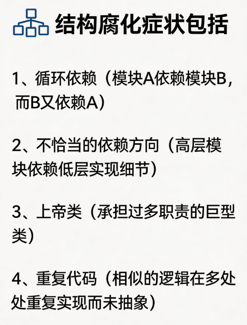

## 引言：复杂性的本质再认识

在软件工程的实践中，复杂性是一个被广泛提及却又常被浅尝辄止的概念。

我们常常听到开发者抱怨“这个系统太复杂了”，却很少有人追问：究竟什么是复杂性？这种复杂性源于何处？它有哪些不同的表现形态？理解这些根本性问题，是有效管理和应对软件复杂性的前提。

传统上，软件工程中的复杂度研究往往聚焦于技术层面，如代码行数、模块数量、执行效率等可量化的指标。

然而，现代软件系统的复杂性早已超越纯粹的技术范畴，蔓延至业务、组织、认知乃至社会互动的层面。

一个成功的软件系统不仅要解决技术实现的难题，还需要在多方利益博弈中找到平衡，在快速变化的需求中保持架构的灵活性，在有限的认知资源下维护代码的可理解性。

领域驱动设计（ DDD ），它尝试从多个维度回应复杂性的挑战。然而，如果仅仅将  DDD  视为一套技术工具或设计模式，而忽视其背后的价值取向和系统性思维，就很难真正发挥其效用。理解不同类型复杂度的本质及其相互关系，是深入理解  DDD 、乃至提升软件工程能力的关键所在。

## 认知复杂度：人脑处理的极限挑战

认知复杂度是软件工程中最为隐蔽却影响最为深远的一种复杂性形态。它指的是人类在理解、记忆、推理和修改软件系统时所面临的心智负担。当我们说某段代码“难以理解”时，实际上就是在描述认知复杂度过高。

认知复杂度的来源是多方面的。

- 首先是结构的深度，即代码执行路径的长度和嵌套层次。当一个函数包含大量的条件分支、循环嵌套和递归调用时，阅读者需要在脑海中维护大量的上下文信息，这种认知负荷会迅速超出人脑的工作记忆容量。心理学研究表明，人类工作记忆的容量大约只有四到七个信息组块，这意味着任何需要同时追踪超过七个以上状态变量的逻辑都会面临理解障碍。

- 其次是依赖的广度。当一个模块与大量其他模块存在耦合关系时，理解该模块的行为需要同时理解它所依赖的所有其他模块。微妙的依赖陷阱尤其危险：看似无害的一行代码可能隐含着对某个遥远模块的依赖，而这个模块又可能依赖其他模块，形成一条长长的依赖链条。追踪这种隐式依赖往往耗时且容易出错。

- 第三是抽象的不一致性。当代码的实际结构与问题域的概念结构不匹配时，开发者在“问题空间”和“解决方案空间”之间来回转换就需要消耗额外的认知资源。例如，一个电子商务系统中的“订单”概念在代码中可能被分散到数据库表、缓存结构、消息队列、API响应等多个地方，每次提到“订单”时都需要明确是在哪个上下文中讨论。

认知复杂度的危害不仅在于降低开发效率，更在于它会引发一系列连锁反应。

复杂度高导致代码难以理解，进而导致难以测试、修改、扩展。当代码库积累了大量复杂业务知识导致复杂度变得越来越高，技术债务便如滚雪球般越滚越大。长期在高复杂度的代码库中工作的开发者还容易产生认知疲劳，职业倦怠的风险也随之上升。

降低认知复杂度的核心策略是尊重人类认知的局限性并据此设计。

通过良好的抽象将复杂度封装在确定的边界内，通过一致性的命名和模式降低理解成本，通过充分的测试和文档将隐式知识显式化，都是行之有效的方法。 DDD 中的限界上下文、聚合、通用语言等概念，本质上都是在尝试将认知复杂度控制在可管理的范围内。

## 结构复杂度：模块组织的艺术

结构复杂度关注的是软件系统各组成部分之间的组织方式和相互关系。

它与认知复杂度密切相关，但侧重点不同：认知复杂度关注的是人的理解难度，而结构复杂度关注的是系统本身的组织质量。一个结构良好的系统可能仍然具有较高的认知复杂度（比如一个实现了复杂算法的模块），但一个结构混乱的系统必然会增加认知复杂度。

结构复杂度的衡量维度包括模块化程度、内聚性、耦合度等。

模块化是将系统分解为相对独立、功能明确的单元的过程，良好的模块化意味着每个模块有清晰的责任边界，模块内部高度内聚而模块之间低耦合。内聚性描述的是一个模块内部各元素共同完成单一功能的程度，高内聚的模块更容易理解和维护，因为其中的所有代码都服务于同一个目的。耦合度则描述模块之间的依赖关系强度，松耦合意味着一个模块的修改对其他模块的影响最小。

结构复杂度的累积往往是一个渐进的过程。

最初，系统可能有着相对清晰的结构，但随着业务需求的变化和新功能的加入，结构会逐渐腐化。常见的结构腐化症状包括：循环依赖（模块A依赖模块B，而B又依赖A）、不恰当的依赖方向（高层模块依赖低层实现细节）、上帝类（承担过多职责的巨型类）、重复代码（相似的逻辑在多处重复实现而未抽象）等。

结构复杂度的控制需要持续的架构审视和重构。

敏捷方法论中的持续重构原则，以及技术债务的概念，都指向同一个认识：结构复杂度必须被主动管理，否则它会像野草一样蔓延。现代软件架构中的许多模式——如分层架构、微服务架构、六边形架构——都可以被视为控制结构复杂度的策略。

 DDD  在控制结构复杂度方面的贡献主要体现在限界上下文的划分上。通过将整个业务领域划分为多个相对独立的限界上下文，每个上下文内部可以拥有自己的模型和架构，跨上下文之间通过明确的接口和协议进行通信。这种划分方式直接降低了结构复杂度，因为原本纠缠在一起的概念和逻辑被明确地分隔开来，各自演进的自由度得以提高。

## 时间复杂度与计算复杂度：算法的效率维度

时间复杂度和计算复杂度是计算机科学中最经典的复杂度概念，主要关注算法执行的效率问题。时间复杂度描述的是算法执行时间随输入规模增长的趋势，常用大O notation表示，如O(n)、O(n log n)、O(n²)等。计算复杂度则更为宽泛，包括时间复杂度、空间复杂度以及算法问题的固有难度分类（如P问题、NP问题等）。

在软件工程实践中，时间复杂度和计算复杂度的重要性不言而喻。一个算法如果具有平方级甚至更高的时间复杂度，在处理大规模数据时可能会变得完全不可用。数据库查询、排序算法、图遍历、机器学习训练等场景都对计算效率有着直接的性能要求。

然而，需要指出的是， DDD 并不直接关注时间复杂度和计算复杂度。这些复杂度更多属于底层实现细节，是算法和数据结构课程讨论的范畴。 DDD 关注的焦点是业务领域的复杂性，而非计算效率的优化。当然，这并不意味着两者完全无关。在某些场景下， DDD 的领域划分策略会间接影响计算效率：如果限界上下文的划分恰好与数据访问模式匹配，可能会获得更好的缓存局部性；如果聚合的设计考虑到一致性边界，可能会减少分布式事务的开销。但这些都是架构决策的副产品，而非 DDD 追求的目标。

对于计算复杂度的管理，更直接的方法包括算法分析与优化、数据结构选型、缓存策略、并行计算等。这些技术通常在 DDD 划定的限界上下文内部发挥作用，属于局部优化范畴。真正复杂的问题往往不是如何优化某个算法，而是如何在业务复杂度、技术复杂度和组织复杂度之间取得平衡。

## 业务复杂度：领域知识的内在挑战

业务复杂度是软件系统所要解决的问题领域本身所具有的复杂性。

它不是由技术实现引入的，而是源于业务本身的属性：业务规则的错综复杂、业务流程的千变万化、业务概念的微妙差异、业务参与者的利益博弈。

**业务复杂度**

- 第一个层面是规则复杂性。

现实世界的业务规则往往不是简单的“是”或“否”，而是充满了例外、变体、条件分支和时序依赖。

例如，一个看似简单的订单退款规则可能需要考虑：订单是否已发货、是否已过退货期限、支付方式是全额退款还是部分退款、是否存在促销活动需要追溯、用户是否是VIP会员享有特殊政策……每一种情况都可能引出不同的处理逻辑，而这些逻辑之间又可能存在相互影响。

- 第二个层面是流程复杂性。

业务流程往往不是线性的，而是充满了分支、循环、并行和人工干预。

订单处理流程可能涉及库存检查、支付验证、物流调度、发票开具、售后服务等多个环节，其中某些环节可能并行执行，某些环节必须串行，某些环节可能因为异常而需要回滚。流程的每一步都可能因为业务需要而发生变化，导致流程的持续演化。

- 第三个层面是概念复杂性。

业务领域中充满了各种专业概念，而不同的人——业务人员、开发者、产品经理——往往对同一概念有着不同的理解。“用户”这个词在不同系统中可能指登录账号、付款人、收货人、决策者等不同实体。“产品”这个词可能指具体的商品SKU，也可能指商品类目，还可能指商品与服务的组合。这种概念的不一致性是业务复杂性的重要来源，也是许多沟通问题和实现错误的根源。

领域模型是 DDD 应对业务复杂性的一种武器：

通过与领域专家的密切协作，识别出领域中的核心概念及其关系，用模型的形式将领域知识显式化。通用语言则是解决概念不一致性的方法：通过建立团队共识，将特定术语及其含义明确下来，并在代码、文档、沟通中统一使用。限界上下文的划分则允许我们将复杂的业务领域分解为可管理的多个子领域，每个子领域可以有自己的模型和术语，避免用统一的模型去硬套整个业务领域的做法。

## 技术复杂度：实现层面的固有困难

技术复杂度指的是在将业务需求转化为可工作的软件系统过程中所涉及的技术层面的复杂性。

它包括**技术选型的复杂性、系统集成的复杂性、性能优化的复杂性、安全保障的复杂性、运维管理的复杂性**等多个方面。

- 技术选型的复杂性

体现在现代软件系统的技术栈日益多样化。从前端框架到后端语言，从数据库类型到消息中间件，从容器编排到服务网格，开发者需要在众多选择中做出权衡。

每种技术都有其适用场景和局限性，选择错误可能导致后续大量的重构工作。同时，技术生态的快速演进也带来了持续学习的压力，一种今天流行的框架可能在几年后就过时了。

- 系统集成的复杂性

源于软件系统很少孤立存在。大多数企业级系统都需要与遗留系统、外部服务、第三方API、数据等多种异构系统进行交互。集成点的增加不仅带来了技术实现上的挑战，更带来了数据一致性、错误处理、版本兼容等问题。

微服务架构虽然提高了单个服务的独立性，却也增加了系统集成的难度，因为分布式系统的问题——网络不可靠、节点会失败、部分组件可能暂时不可用——都需要被妥善处理。

- 性能优化和安全保障是技术复杂度

这是两个永恒主题。前者要求开发者在响应时间、吞吐量、资源利用率之间取得平衡，往往需要在代码质量、可维护性和极致性能之间做出取舍。

后者则需要应对日益复杂的网络攻击和数据泄露风险，从身份认证到数据加密，从访问控制到安全审计，每个环节都不能有疏漏。

- 运维管理的复杂性

在云计算和容器化时代更加突出。持续集成、持续部署、监控告警、日志管理、灾备恢复等运维实践需要专业的工具链和流程支撑。

系统的可观测性——即从外部输出推断系统内部状态的能力——是现代运维的核心要求之一。

 

## 组织复杂度与社会复杂性：人的因素

软件系统最终是由人构建和使用的，而人的因素往往是复杂性最不可控的来源。组织复杂度关注的是在大型软件开发中，由于人员、团队、组织结构等因素带来的复杂性。

 Conway 定律指出，设计系统的组织实际上是在生产这些组织沟通结构的副本。

换言之，系统的架构往往是组织结构的镜像。如果一个组织中的团队按技术职能划分（前端团队、后端团队、数据库团队），那么其系统架构很可能会反映出这种筒仓式的结构，而非按业务能力组织的架构。这种结构会增加跨团队沟通的成本，延长决策周期。

利益相关方的多元性带来了另一层复杂性。

在一个典型的企业软件项目中，可能涉及高层管理者、产品经理、业务分析师、项目经理、开发者、测试工程师、运维工程师、最终用户等多个群体。每个群体都有自己的诉求、优先级和考量。高层管理者关注投资回报率和战略价值，产品经理关注功能和用户体验，业务部门关注业务流程的效率，用户关注易用性，开发者关注代码质量和职业发展，运维关注稳定性和可管理性。这些诉求之间往往存在冲突，需要通过沟通和协商来平衡。

组织政治的复杂性也不容忽视。

技术决策往往不是纯粹的技术问题，而是涉及权力、资源分配和部门利益。在某些组织中，采纳某种新技术或架构可能意味着某个团队的扩张或缩减，这会引发政治博弈。技术债务的积累有时不是因为技术上的无奈，而是因为组织压力下的短期决策。

 DDD 在应对组织复杂度方面有其独特价值。

限界上下文的划分往往与组织边界对齐，这种对齐可以减少跨团队的协调成本，因为每个限界上下文可以由一个相对稳定的团队负责，团队成员对上下文内的业务和技术有深入的理解。领域事件的发布-订阅模式也为松耦合的团队协作提供了技术基础：发布方不需要知道订阅方的具体实现，团队之间可以通过事件接口进行协作。

## 复杂度的相互关系与动态演化

上述各种复杂度并非孤立存在，而是相互影响、相互转化的。理解这些复杂度的关系，是系统性地管理和应对复杂性的关键。

认知复杂度与结构复杂度之间存在强烈的正相关，但并非简单的线性关系。

良好的结构可以降低认知复杂度——将系统分解为清晰的模块后，理解每个模块的工作原理比理解整个系统要容易得多。但糟糕的结构会增加认知复杂度，循环依赖和隐式依赖会让开发者花费大量时间追踪代码的执行路径。然而，即使结构良好的系统，如果领域本身固有的复杂性很高，认知复杂度仍然可能超出可接受的范围。此时，可能需要通过更好的抽象、文档、培训等手段来补充。

业务复杂度与技术复杂度之间存在有趣的交互。

在某些情况下，增加技术复杂度可以帮助降低业务复杂度——例如，引入规则引擎可以将复杂的业务规则从应用代码中分离出来，使业务规则的变更更加灵活。但这种转换也可能带来新的问题：规则引擎本身的学习曲线、调试困难、可测试性下降等。反之，不恰当的技术选型可能使原本不复杂的业务逻辑变得难以理解和维护。

认知复杂度与组织复杂度之间的关系在大型项目中尤为明显。

当团队规模扩大时，团队成员对系统整体结构的认知就会出现差异。有经验的成员可能理解系统的全局设计，而新加入的成员可能只熟悉自己工作的局部。知识在团队内部的分布不均会导致跨模块的工作需要更多的沟通和协调，这实际上是增加了组织复杂度，而组织复杂度的增加又会反过来影响认知复杂度——当需要理解一个涉及多个团队负责模块的功能时，沟通成本会急剧上升。

复杂度的动态演化是另一个需要关注的维度。

软件系统在其生命周期中会经历多次演化，复杂性也会随之变化。业务的发展会带来新的业务规则、新的流程、新的概念，这些都会增加业务复杂度。技术债务的积累会逐渐增加结构复杂度和认知复杂度。团队成员的流动会导致组织知识的流失，增加组织复杂度。这种演化往往是不可逆的——即使后来进行了重构，过程中消耗的资源和承受的风险也无法挽回。因此，复杂度的主动管理和预防性设计比被动的应对更为重要。

## 领域驱动设计对复杂度管理的整体视角

基于对上述各种复杂度的分析，我们能够更深入地理解 DDD 的定位和价值。 DDD 并非万能的复杂度解决方案，但它提供了一种整体性的视角来审视和处理软件系统的复杂性。

从复杂度的视角重新审视 DDD 的核心概念，我们可以发现：

领域模型是一种认知复杂度的管理工具，通过将业务概念显式化、模型化，降低业务逻辑的理解难度；限界上下文是一种结构复杂度和组织复杂度的管理工具，通过划分清晰的边界，将复杂系统分解为可管理的子单元；通用语言是一种沟通复杂度的管理工具，通过建立共享的概念框架，减少误解和沟通成本；聚合和领域事件是业务复杂度和一致性管理的工具，通过明确的事务边界和事件驱动机制，降低分布式系统的复杂度。

 DDD 的成功实施需要对多种复杂度的同时关注。

过度关注业务建模而忽视技术实现，可能导致领域模型优雅但系统难以运维；过度关注技术细节而忽视业务理解，可能导致系统结构良好但无法有效支持业务；过度关注内部领域而忽视与外部系统的集成，可能导致限界上下文成为新的信息孤岛。因此， DDD 的实施需要技术能力与业务理解并重，架构设计与组织治理兼顾。

## 结语：与复杂性共处

复杂性是软件系统的固有属性，无法消除，只能管理。不同的软件工程方法论——无论是 DDD 、敏捷、精益还是传统的方法论——都是在复杂性约束下做出的权衡。理解认知复杂度、结构复杂度、业务复杂度、技术复杂度、组织复杂度等不同维度的复杂性及其相互关系，是做出明智权衡的前提。

复杂性管理没有银弹，但有原则可循。

- 首先是分而治之：将大问题分解为小问题，将高复杂度分解为低复杂度。

- 其次是持续审视：定期检视系统的复杂度状态，识别腐化点，及时重构。第三是适度抽象：用良好的抽象隐藏不必要的细节，降低认知负担。

- 第四是团队共识：在复杂度管理策略上达成共识，避免各自为政。

- 第五是权衡智慧：认识到任何决策都有代价，在复杂度的各个维度之间寻求平衡，而非追求某一维度的极致。

最终，软件开发的艺术在于与复杂性共处：在复杂性不可避免的世界中，通过智慧和实践，将复杂性转化为可管理的、可理解的、可持续演进软件系统。这或许是比任何具体方法论都更为根本的软件工程智慧。