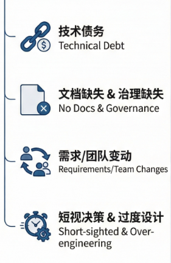

## 摘要

软件架构腐化是软件开发过程中一种渐进式的质量衰退现象，随着系统规模扩大和业务复杂度增加，原始设计逐渐失去其指导价值和约束能力，导致系统变得难以维护、理解、扩展和演进。

本文深入分析了软件架构腐化的成因，探讨了技术债务累积、缺乏文档管理、需求频繁变更、团队人员流动、短视决策、过度设计以及缺乏有效治理等核心根源因素。

在此基础上，本文提出了一套系统性的防范方法论，涵盖架构原则建立、代码审查机制、自动化测试体系、重构文化培育、架构度量监控以及持续演进策略等关键实践领域。

通过对这些根源与防范方法的深入剖析，本文旨在为软件工程团队提供系统性的认知框架和实践指南，帮助他们在软件开发过程中有效识别、预防和应对架构腐化问题，确保软件系统的长期健康可持续发展。

## 1 引言

软件架构作为软件系统的顶层设计，定义了系统的结构组成、组件关系、交互模式以及约束边界，是指导整个软件生命周期开发与维护的核心蓝图。一个良好的软件架构应当具备清晰性、可维护性、可扩展性、可测试性和可部署性等关键质量属性，为开发团队提供明确的技术指引和决策依据。

然而，在实际的软件工程实践中，软件架构往往随着时间的推移而逐渐偏离其原始设计理念，演变成一种难以理解、难以修改、难以扩展的复杂结构，这种现象被业界定义为“软件架构腐化”（Software Architecture Erosion 或 Architecture Drift）。

软件架构腐化并非一蹴而就的突发问题，而是一种渐进的、累积式的质量衰退过程。

在项目初期，架构设计通常经过深思熟虑，具备良好的结构和清晰的分层。

然而，随着业务需求的不断变化、开发团队的更迭、技术债务的累积以及各种短期压力驱动下的决策妥协，架构逐渐失去其原有的约束力和指导作用，系统内部的结构变得混乱，组件之间的依赖关系变得复杂且难以追踪，最终导致系统变成一团难以维护的“意大利面条”代码。这种腐化不仅影响开发效率，增加运维成本，还会削弱组织的创新能力，延长产品上市时间，严重时甚至可能导致项目的彻底失败。

深入理解软件架构腐化的根源，对于预防和治理这一问题是至关重要的一步。

软件架构腐化是一个多因素驱动的复杂过程，涉及技术、管理、组织和文化等多个维度的因素。单纯从技术角度进行治理往往难以取得持久的效果，必须结合组织管理实践和文化建设，才能从根本上遏制架构腐化的趋势。同时，防范软件架构腐化也需要一套系统性的方法论和实践指南，帮助团队在日常开发活动中形成良好的架构意识和工程习惯。

本文将从软件架构腐化的定义和表现入手，系统性地分析导致架构腐化的各类根源因素，包括技术债务、文档缺失、需求变化、团队变动、短视决策、过度设计和治理缺失等。

在此基础上，本文将深入探讨相应的防范方法和最佳实践，涵盖架构原则、代码审查、自动化测试、重构文化、架构度量和持续演进等关键领域。

​                                                                                   (软件架构腐化的各类根源因素)

通过对这些内容的深入剖析，本文旨在为软件工程领域的从业者提供系统性的认知框架和可操作的实践指南，帮助他们有效应对软件架构腐化这一长期困扰软件行业的挑战。

## 2 软件架构腐化的根源分析

### 2.1 技术债务的累积与侵蚀

技术债务是软件架构腐化最直接、最常见的根源之一。

Ward Cunningham提出的技术债务隐喻深刻地揭示了软件开发中短期权衡与长期代价之间的辩证关系。技术债务涵盖的范围广泛，既包括有意为之的技术折中方案，也包括无意中形成的代码质量问题。无论是哪种形式的技术债务，

如果不能得到及时的管理和偿还，都会像金融债务一样产生利息效应，随着时间的推移不断累积，最终侵蚀架构的完整性和健康度。

有意积累的技术债务通常发生在项目面临紧迫的时间压力或资源限制时，团队为了快速交付功能而采取的非最优技术方案。

例如，为了赶在产品发布前完成功能，开发人员可能绕过正常的代码审查流程，直接在生产代码中添加临时性的解决方案；或者为了快速响应业务需求，在本应保持解耦的模块之间引入直接的硬编码依赖。这些决策在短期内看似合理且有效，但它们会在系统中埋下隐患，形成难以追踪和清理的技术债务。

无意的技术债务则更多源于开发过程中的疏忽和经验不足。缺乏统一的编码规范导致代码风格不一致，缺少必要的单元测试使得代码质量难以保证，不当的错误处理机制增加了系统的脆弱性，重复的代码片段浪费了维护成本。这些看似微小的质量问题累积起来，会显著增加系统的复杂度，降低代码的可读性和可维护性。

技术债务的利息效应是架构腐化的关键驱动力。随着技术债务的累积，每次修改系统都需要额外的精力来处理历史遗留问题，开发效率持续下降。更糟糕的是，为了偿还一部分技术债务而进行的修改往往会引入新的技术债务，形成恶性循环。当技术债务超过某个临界点后，系统将陷入“改不动”的困境，任何变更都可能引发意想不到的问题，架构的实际结构与设计初衷渐行渐远。

### 2.2 文档缺失与知识断层

文档是软件架构的重要载体，承载着设计决策的意图、系统的结构信息以及组件之间的交互约定。当文档缺失或过时严重时，架构的意图和约束将变得难以追溯，新加入的团队成员无法理解系统的设计原理，只能凭借直觉和试错来理解系统行为，这种盲目的探索过程往往会加速架构的腐化。

架构文档缺失的原因是多方面的。

- 首先，编写文档往往被视为不如编写代码重要的“额外工作”，在紧迫的项目进度面前被优先牺牲。

- 其次，文档需要随着系统的演进持续更新，但维护文档的纪律性往往难以保证，导致文档很快变得过时，进而失去参考价值甚至产生误导。当文档与实际代码严重脱节时，开发人员会逐渐放弃对文档的信任，形成不依赖文档的“默契”，这种默契在短期内有效率，但长期来看加剧了知识集中于少数人的风险。

知识断层是文档缺失的直接后果，也是架构腐化的重要催化剂。

在软件开发中，核心架构知识通常集中在少数资深开发人员或架构师脑中。当这些关键人员离开项目或组织时，宝贵的架构知识随之流失。接任者面对缺乏文档的系统，只能通过阅读代码来理解系统行为，而代码只能展示“是什么”而无法说明“为什么”，设计决策的深层意图和约束条件往往被遗忘。这种知识的流失使得后续的修改更加困难，增加了引入错误的风险，也使得架构偏离原始设计的可能性大增。

### 2.3 需求变化与业务演进

需求变化是软件架构腐化的重要推动力。业务环境的变化、客户要求的调整、市场条件的转变都会驱动软件系统不断演进。在这个过程中，如果架构设计缺乏足够的灵活性和适应性，频繁的需求变更将导致架构逐渐偏离其原始设计轨迹，形成架构腐化。

需求变化对架构的影响主要体现在以下几个方面。

首先，原始架构通常是针对特定业务场景和功能需求设计的，当新需求超出架构的预设范围时，开发人员可能被迫采取“打补丁”的方式实现功能，而不是通过重构来扩展架构。其次，紧急需求往往伴随着对架构原则的妥协，为了快速交付而牺牲架构质量。再者，需求变更可能涉及跨模块的功能调整，这会破坏原有的模块边界和依赖关系，导致架构的内聚性下降、耦合性上升。

业务演进带来的挑战更加系统化。

随着企业的发展，软件系统需要支持更大的规模、更多的用户、更复杂的业务逻辑。初始架构可能无法预见这些演进方向，缺乏相应的扩展机制。当系统规模增长到一定程度时，原本设计合理的架构可能成为性能瓶颈或维护障碍，迫使开发人员采取各种变通方案，这些变通方案逐步累积，最终导致架构面目全非。

### 2.4 团队变动与经验流失

软件开发是一项知识密集型的智力活动，团队成员的经验、技能和对系统的理解直接影响着架构的保持与演进。团队的高流动性是软件行业的普遍特征，这种流动性对架构的稳定性构成了持续挑战。

新加入的团队成员面临陡峭的学习曲线，他们需要尽快理解系统的结构和行为，才能有效地参与开发工作。

然而，如前所述，当文档缺失或不完整时，学习过程主要依赖对代码的阅读和分析。在这个过程中，新成员可能对架构的某些设计决策产生误解，或者发现一些“奇怪”的实现方式而不知道背后的原因，从而做出与架构原意不符的修改。即使有经验的开发人员加入一个陌生的系统，也很难在短时间内完全把握系统的全部上下文，这种认知局限性可能导致无意的架构破坏。

团队变动还会影响组织的技术能力和架构治理能力。

核心架构知识往往存在于团队成员的长期实践中，而非正式的文档或规范。当关键人员离职时，这些隐性知识可能随之流失，导致团队整体技术能力的下降。同时，频繁的团队变动使得建立和维护统一的架构原则变得困难，不同背景的成员可能带来不同的技术理念和编码习惯，这种多样性虽然有其价值，但也可能造成架构的不一致和混乱。

### 2.5 短视决策与即时满足

软件开发中普遍存在的短期主义倾向是架构腐化的重要根源之一。在商业压力和时间紧迫的环境下，团队往往倾向于做出能够立即产生效果的技术决策，而忽视这些决策对系统长期健康的影响。这种“快餐式”的开发文化虽然满足了眼前的交付需求，却为未来的维护和演进埋下了隐患。

短视决策的表现形式多种多样。

在代码层面，复制粘贴式的代码复用虽然提高了短期开发效率，却导致了代码重复和维护困难；嵌套过深的条件判断和过长的函数增加了代码的复杂性，降低了可读性；硬编码的配置值和魔法数字削弱了系统的灵活性。在架构层面，在已有架构上直接添加新功能而不是通过扩展点实现，使得架构逐渐失去清晰的结构；使用简单的直接调用而不是抽象的接口解耦，增加了组件之间的耦合度；忽视非功能性需求如性能、安全性和可扩展性，只关注功能性需求的实现。

短视决策的代价往往在事后才显现。

当系统需要支持新的业务场景时，原本看似合理的快速方案可能成为障碍；当需要修复一个看似简单的bug时，却发现它涉及到多个相互关联的组件；当需要重构某个模块时，却发现它与系统的太多其他部分耦合。这些“意外”实际上是短视决策累积效应的必然结果，只是它们的影响被延迟了而已。

### 2.6 过度设计的前期负债

与短视决策相反，过度设计同样会导致架构腐化，只是其作用机制有所不同。过度设计发生在系统开发初期，表现为对系统未来需求的不切实际的预设，以及为这些假设需求预留的过度复杂的设计结构。过度设计使得系统在初期就背负了不必要的复杂性负担。

过度设计的典型特征包括：

- 为了应对“将来可能”需要的功能，设计了过于抽象和通用的框架；

- 为了支持“也许会来”的扩展需求，引入了一层又一层的间接层；

- 为了追求“完美”的设计，引入了大量看似优雅但实际并不需要的抽象和接口。

这些过度设计在初期可能看起来很有远见，但当实际需求明确后，往往发现这些预设是完全错误的，之前的投入变成了沉没成本。

过度设计的危害是多方面的。首先，它增加了系统的复杂度，使得系统难以理解和维护。其次，它降低了开发效率，开发人员需要在复杂的架构中穿梭来实现简单的功能。再者，它可能引入不必要的性能开销，影响系统的响应速度和资源效率。最后，过度设计的系统往往过于刚性，难以适应实际的、具体的新需求，当需求与预设不符时，可能需要进行大规模的重构而不是简单的扩展。

### 2.7 缺乏架构治理与约束

架构治理是维护架构完整性的重要保障机制。当缺乏有效的架构治理时，架构原则和设计约束难以得到执行，架构决策的随意性增加，架构腐化的风险随之上升。

架构治理缺失的表现形式包括：

没有明确的架构原则或设计规范来指导开发人员的决策；没有架构评审机制来审查重要的技术决策；

没有架构守护者来确保架构决策得到遵守；没有架构度量来监控架构的健康状况。

在缺乏治理的环境中，每个开发人员都可能按照自己的理解和偏好做出技术决策，这些局部最优的决策累积起来，可能导致整体的架构混乱。

架构治理的缺失还表现为决策权的分散和不明确。在大型组织中，不同的团队可能独立做出影响全局的技术决策，而缺乏跨团队的协调机制。当这些决策相互冲突时，没有明确的机制来解决冲突，结果往往是妥协式的、临时的解决方案，这些方案缺乏整体视角，可能在短期内解决问题，却加剧了长期的架构问题。

## 3 软件架构腐化的防范方法

### 3.1 建立架构原则与设计准则

建立明确、一致且可执行的架构原则是防范架构腐化的首要步骤。架构原则是指导技术决策的基本准则，它们定义了什么是允许的、什么是鼓励的、什么是禁止的，为开发团队提供了统一的决策框架。

有效的架构原则应当具备以下特征。首先，原则应当简洁明了，容易理解和记忆，复杂的原则难以被遵守。其次，原则应当具体可操作，能够指导实际的技术决策，而不是抽象的概念陈述。再者，原则应当适用于组织的具体上下文，不同的组织、不同的项目可能有不同的原则要求。最后，原则应当在团队内达成共识，得到广泛认可而不是自上而下的强制命令。

常见的架构原则包括：

- 模块化原则，要求系统被分解为具有明确职责的模块，模块之间通过定义良好的接口进行交互；

- 高内聚低耦合原则，鼓励将相关功能放在同一模块中，同时最小化模块之间的依赖；

- 单一职责原则，要求每个组件只承担一个职责，降低组件的复杂性；

- 开闭原则，建议系统对扩展开放、对修改封闭，通过扩展而非修改来适应新需求；

- 依赖倒置原则，鼓励依赖抽象而不是具体实现，降低耦合度。

架构原则需要与具体的项目和技术环境相结合，才能发挥实际作用。在制定原则时，应当考虑团队的技术能力、项目的业务特点以及组织的战略目标。同时，原则应当定期回顾和更新，以反映新的技术发展和业务变化。

### 3.2 实施严格的代码审查机制

代码审查是保障代码质量和架构一致性的重要机制。通过同行评审，代码审查可以在问题进入代码库之前被发现和修复，减少技术债务的累积，同时促进团队内部的知识分享和技能提升。

有效的代码审查应当关注多个维度。

在功能性方面，审查者应当检查代码是否正确实现了预期的功能，是否处理了边界情况和错误条件，是否有潜在的逻辑错误。

在可维护性方面，审查者应当评估代码的可读性、复杂度和结构，是否遵循了组织的编码规范，是否存在重复代码和过度的嵌套。

在架构一致性方面，审查者应当检查代码是否符合架构原则和设计准则，是否引入了不当的依赖，是否破坏了模块边界。

代码审查的实践需要根据组织的具体情况进行调整。过于形式化的审查可能流于表面，难以发挥实际作用；过于严格的审查可能降低开发效率，影响团队士气。有效的代码审查应当在保证质量的同时，保持适当的效率和节奏。一些组织采用结对编程的方式，将代码审查融入日常开发过程；一些组织采用定期的审查会议，对重要变更进行集中讨论；还有一些组织利用自动化工具辅助审查，提高审查的效率和覆盖率。

代码审查不仅是一种质量保障手段，更是一种知识传播和技能提升的途径。通过审查，被审查者可以从审查者的反馈中获得改进建议；审查者可以通过阅读他人的代码了解不同的实现方式和设计思路。这种双向的知识流动有助于提升团队整体的技术能力和架构意识。

### 3.3 构建全面的自动化测试体系

自动化测试是保障软件质量和架构完整性的技术基础。通过全面的测试覆盖，可以在代码变更时及时发现引入的问题，防止架构腐化的蔓延。测试金字塔理论建议建立包括单元测试、集成测试和端到端测试在内的多层次测试体系，不同层次的测试关注不同的质量维度。

单元测试是测试体系的基础，它们针对代码的最小单元进行验证，确保每个函数或方法的行为符合预期。单元测试应当关注代码的逻辑正确性、边界条件处理和错误处理机制。在架构层面，单元测试有助于验证组件的独立性和可测试性，如果一个组件难以编写单元测试，往往说明它存在过度依赖或职责不清的问题。

集成测试验证组件之间的交互是否正确，它们对于检测模块边界和接口契约的违反尤为重要。在架构治理中，集成测试可以帮助发现不当的依赖关系、循环依赖以及架构约束的破坏。通过监控集成测试的状态和覆盖率，可以及时发现架构腐化的迹象。

端到端测试验证整个系统的行为是否符合业务需求，它们对于确保系统整体的功能正确性至关重要。虽然端到端测试的维护成本较高，覆盖所有用户场景也不现实，但它们对于关键业务流程的验证是不可替代的。

测试驱动开发（TDD）是一种将测试置于开发过程核心的实践方法，它要求在编写功能代码之前先编写测试用例。TDD的实践有助于产生高可测试性的代码，同时通过频繁的测试运行提供快速的反馈。虽然TDD并非适用于所有场景，但它的核心理念——先思考期望的行为，再实现代码——对于提升代码质量和架构设计是有价值的。

### 3.4 培育持续重构的文化

重构是改善现有代码结构和架构设计的系统性实践，它在不改变代码外部行为的前提下，提升代码的内部质量。培育持续重构的文化，意味着将重构融入日常开发活动，而不是将它视为一次性的、集中的大工程。

持续重构的关键在于小步快跑、及时清理。

每次代码变更都是审视和改进代码的机会，当开发人员发现需要改进的地方时，应当及时处理，而不是留待以后。累积的技术债务会降低开发效率，增加出错风险，及时偿还债务虽然需要短期投入，但长期来看是划算的。Refactoring as you go的理念鼓励开发人员在日常工作中保持对代码质量的关注，而不是在问题变得严重后才采取行动。

为了支持持续重构，需要建立必要的保障机制。

- 首先，要有足够的测试覆盖来确保重构的安全性，重构前后的行为一致性需要通过测试来验证。

- 其次，要有重构的支持工具，如IDE提供的重构功能、代码质量检查工具等。再者，要在团队中建立重构的共识，将重构视为正常开发过程的一部分，而不是额外负担。

- 最后，要为重构分配合理的时间和资源，在项目计划中为重构预留空间。

重构文化还意味着对代码改进的积极态度。当代码被指出需要改进时，不应当视为批评而应当视为改进的机会。重构的提案应当得到鼓励和支持，而不是被拒绝或推迟。同时，也需要避免无意义的重构，重构应当有明确的目标和收益，而不是为了“玩弄”代码或追求形式上的完美。

### 3.5 建立架构度量与监控体系

度量是管理的基础，建立架构度量体系可以客观地评估架构的健康状况，发现架构腐化的早期迹象，并为架构决策提供数据支持。通过持续监控架构度量，可以在问题变得严重之前采取预防措施。

架构度量可以从多个维度进行设计。

结构度量关注系统的组织结构，包括模块的粒度、内聚性和耦合度等指标，例如包内聚性度量（PCT）、循环依赖度量、稳定性度量等。变更度量关注代码变更的频率和模式，例如最近修改过的文件数量、修改频率的分布等，频繁变更的代码区域可能是架构问题的信号。

复杂度度量评估代码的静态复杂度，包括圈复杂度、代码行数、嵌套深度等指标，高复杂度的代码难以理解和维护。依赖度量分析组件之间的依赖关系，包括依赖的层级、扇入扇出、不当依赖等。

架构度量需要与业务和技术上下文相结合才能产生价值。

单纯的度量数据本身没有意义，重要的是对度量的解释和响应。当某个度量指标出现异常变化时，应当分析背后的原因，判断是否存在架构问题。对于架构度量阈值的设定，需要根据系统的具体特点进行调整，通用性的阈值可能不适用于特定场景。

架构度量应当成为持续集成/持续部署流程的一部分，通过自动化工具收集和报告度量数据，使架构健康状况对团队可见。可视化的架构仪表板可以直观地展示架构的当前状态和历史趋势，帮助团队监控架构的长期变化。

### 3.6 实施架构守护与演进策略

架构守护是确保架构决策得到执行的治理活动，它需要有明确的角色和职责来负责架构的完整性和一致性。架构守护者（如架构师、技术负责人）应当参与重要的技术决策，审查可能影响架构的变更，并提供架构相关的指导和建议。

架构守护的工作内容包括多个方面。

首先是架构评审，对重要的技术方案和设计决策进行审查，确保它们符合架构原则和设计准则。架构评审应当在决策早期进行，而不是在实现完成后，以避免资源的浪费。

其次是架构咨询，为开发团队提供架构相关的技术指导，帮助他们理解架构的意图和约束，以及如何在实际开发中应用架构原则。

再者是架构监控，通过度量和检查等手段监控架构的健康状况，发现和预警潜在的架构问题。

架构演进是应对需求变化和业务发展的重要策略。与其试图一次性设计出完美架构，不如采用渐进式的演进策略，允许架构随着业务的发展而逐步完善。演进式架构的核心思想是拥抱变化，通过模块化、插件化等技术手段，使系统能够方便地增加、修改或替换功能，而不影响其他部分。服务化、微服务化等架构风格体现了演进式架构的理念，它们通过将系统分解为独立部署的服务，使每个服务可以独立演进。

架构演进需要与业务规划相协调。技术债务的偿还、新技术的引入、架构的重构都需要投入资源，这些投入应当与业务价值相联系，形成合理的优先级排序。在资源有限的情况下，应当优先处理那些对业务影响最大、风险最高的架构问题，而不是试图一次性解决所有问题。

## 4 结论

软件架构腐化是软件开发过程中不可回避的挑战，它源于技术、管理、组织和文化等多重因素的交织作用。

技术债务的累积、文档缺失、需求变化、团队变动、短视决策、过度设计以及缺乏治理等根源因素相互作用，推动着架构逐渐偏离其原始设计，变得难以维护和演进。认识这些根源因素是预防和治理架构腐化的前提。

防范软件架构腐化需要采取系统性的方法，综合运用技术手段、管理实践和文化建设。

建立明确的架构原则为团队提供统一的决策框架；实施严格的代码审查保障代码质量和架构一致性；构建全面的自动化测试体系提供质量保障和安全网；培育持续重构的文化及时偿还技术债务；建立架构度量与监控体系客观评估架构健康状况；实施架构守护与演进策略确保架构决策得到执行并能够适应变化。

软件架构腐化的治理是一个持续的过程，而非一次性的活动。

随着业务的发展和技术的变化，新的挑战会不断出现，原有的架构需要不断调整和完善。组织需要建立长期的架构治理机制，持续投入资源维护架构的质量，而不是在问题变得严重后才采取行动。只有将架构治理融入日常的开发活动，形成重视架构质量的团队文化，才能有效地预防和应对软件架构腐化，确保软件系统的长期健康可持续发展。

## 参考文献

[1] Fowler M. Refactoring: Improving the Design of Existing Code [M]. Addison-Wesley Professional, 2018.

[2] Cunningham W. The WyCash Portfolio Management System [J]. ACM SIGPLAN OOPS Messenger, 1992, 4(2): 29-30.

[3] Martin R C. Clean Architecture: A Craftsman's Guide to Software Structure and Design [M]. Prentice Hall, 2017.

[4] Gamma E, Helm R, Johnson R, et al. Design Patterns: Elements of Reusable Object-Oriented Software [M]. Addison-Wesley Professional, 1994.

[5] Lehman M M, Belady L A. Program Evolution: Processes of Software Change [M]. Academic Press, 1985.

[6] Spring M, Dynamical M. What Is Technical Debt? [EB/OL]. Martin Fowler, 2014.

[7] Rozanski N, Woods E. Software Systems Architecture: Working With Stakeholders Using Viewpoints and Perspectives [M]. Addison-Wesley Professional, 2011.

[8] Bass L, Clements P, Kazman R. Software Architecture in Practice [M]. Addison-Wesley Professional, 2012.

[9] Beck K. Test Driven Development: By Example [M]. Addison-Wesley Professional, 2002.

[10] McConnell S. Code Complete: A Practical Handbook of Software Construction [M]. Microsoft Press, 2004.

